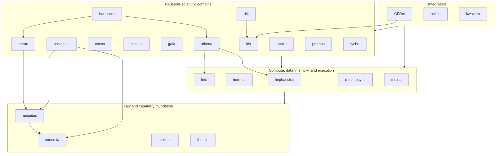

# atlas

Meta-repository for the Rust workspaces that form the Atlas multiphysics
simulation stack. Atlas coordinates numeric laws, memory and execution
providers, reusable scientific domains, and end-user simulation suites without
collapsing their independent release histories.

## Repository model

`atlas` is an orchestration repository, not a Cargo workspace. Each package is
an independent Git repository mounted at `repos/<name>` as a submodule.

The root repository owns:

- the exact package set and remotes in [`.gitmodules`](.gitmodules);
- a reproducible stack revision through the recorded submodule gitlinks;
- cross-package build and verification drivers in [`scripts/`](scripts);
- stack-wide architecture decisions in [`docs/adr/`](docs/adr).

Each package owns its crate topology, direct dependencies, lockfile, tests,
release policy, and detailed documentation. The package's `Cargo.toml` and
`Cargo.lock` are authoritative for direct dependency edges; this README
documents bounded-context ownership and must not be read as an exact Cargo
dependency graph.

Shared first-party capabilities follow provider-first ownership. A missing
operation is implemented in the provider that owns its bounded context, then
consumers update their pins. Consumer-local compatibility layers and duplicate
provider implementations are not part of the Atlas model.

### Revision contract

The parent gitlink is the reproducible package revision. A local package
checkout may temporarily point elsewhere or contain uncommitted work without
changing the Atlas revision. Use `git diff --submodule=log` to distinguish a
published child commit from modified child content, and never advance a
gitlink solely to make the parent working tree appear clean.

Directories below `repos/` that are absent from `.gitmodules` are not part of
the recorded stack. They are local work until they independently satisfy the
[promotion gate](#promotion-gate) and enter Atlas through a reviewed submodule
addition.

## Current stack

At this revision, [`.gitmodules`](.gitmodules) records 24 packages.

| Layer | Repository | Canonical role |
| --- | --- | --- |
| Integrator | [`CFDrs`](repos/CFDrs) | Computational fluid dynamics, coupled flow simulation, validation, and scientific output. |
| Integrator | [`helios`](repos/helios) | Radiation-therapy dose, planning, imaging, and delivery simulation. |
| Integrator | [`kwavers`](repos/kwavers) | Acoustic, ultrasound, therapy, imaging, and coupled wave simulation. |
| Domain | [`apollo`](repos/apollo) | Fourier, spectral, wavelet, number-theoretic, and related transforms. |
| Domain | [`asclepius`](repos/asclepius) | Biological-response, tissue-effect, treatment-response, and therapy-outcome laws over Aequitas quantities and Eunomia scalars, with a one-way Coeus adapter. |
| Domain | [`athena`](repos/athena) | Backend-neutral PCG and restarted GMRES over Leto CPU and Hephaestus WGPU execution. |
| Domain | [`coeus`](repos/coeus) | Strided tensors, automatic differentiation, neural networks, optimization, and sparse operations. |
| Domain | [`consus`](repos/consus) | Native scientific storage formats, compression, and data transport. |
| Domain | [`gaia`](repos/gaia) | Geometry predicates, topology, watertight meshes, and mesh generation. |
| Domain | [`harmonia`](repos/harmonia) | Transactional partitioned multiphysics coupling, interface transfer, relaxation, and heterogeneous subcycling. |
| Domain | [`horae`](repos/horae) | Typed simulation time, explicit integration, adaptive policy, event clipping, and subcycle ratios. |
| Domain | [`iris`](repos/iris) | Domain-neutral normalized colors, fixed lookup tables, borrowed diagnostic views, and render-backend contracts. |
| Domain | [`proteus`](repos/proteus) | Validated material-property, material-identity, and static constitutive-law vocabulary parameterized by Aequitas quantities and Eunomia scalars. |
| Domain | [`ritk`](repos/ritk) | Medical-image formats, processing, registration, domain-specific visualization, and VTK data models. |
| Domain | [`tyche`](repos/tyche) | Uncertainty quantification, sampling, ensembles, sensitivity, and reproducible stochastic studies over Moirai execution and Consus persistence. |
| Compute | [`hephaestus`](repos/hephaestus) | GPU device, buffer, transfer, and kernel substrate for WGPU and CUDA. |
| Compute | [`hermes`](repos/hermes) | CPU SIMD/SWAR vocabulary, ISA dispatch, and vector kernels. |
| Compute | [`leto`](repos/leto) | N-dimensional host arrays, layouts, views, operations, and linear algebra. |
| Compute | [`mnemosyne`](repos/mnemosyne) | Allocation, arenas, heaps, staging memory, and allocator instrumentation. |
| Compute | [`moirai`](repos/moirai) | Scheduling, parallel iteration, async execution, synchronization, and transport. |
| Foundation | [`aequitas`](repos/aequitas) | Physical-quantity law: type-level SI dimensions, transparent quantities, and linear-unit conversion over Eunomia scalars. |
| Foundation | [`eunomia`](repos/eunomia) | Datatype law: scalar, complex, packed, conversion, and numeric-trait vocabulary. |
| Foundation | [`melinoe`](repos/melinoe) | Branded capability evidence for memory access and synchronization. |
| Foundation | [`themis`](repos/themis) | Placement law for NUMA nodes, workers, locality domains, and memory tiers. |

The diagram is a layer map, not a literal manifest graph. Higher layers consume
contracts owned below them, and a package may legitimately skip an intermediate
layer.



### Provider ownership

| Concern | Owner | Boundary |
| --- | --- | --- |
| Physical quantities and dimensional law | `aequitas` | Owns dimensions and linear units over Eunomia scalars, not scalar representations or domain validity. |
| Numeric representations and scalar laws | `eunomia` | Owns datatype vocabulary, not algorithms or storage. |
| Placement and locality law | `themis` | Owns typed placement facts, not allocation or scheduling. |
| Capability proofs | `melinoe` | Owns branded access evidence, not memory management. |
| Allocation and memory policy | `mnemosyne` | Owns host allocation, arenas, heaps, and staging memory. |
| Execution and transport | `moirai` | Owns scheduling, parallelism, async execution, synchronization, and transport. |
| CPU lane-parallel execution | `hermes` | Owns SIMD/SWAR kernels and runtime ISA selection. |
| Host arrays and linear algebra | `leto` | Owns layouts, views, array operations, and CPU linear algebra. |
| Accelerator execution | `hephaestus` | Owns GPU devices, buffers, transfers, pipelines, and provider kernels. |
| Time-integration policy | `horae` | Owns typed simulation time, explicit stepping, adaptive decisions, event clipping, and subcycle ratios; equations remain in domain packages. |
| Iterative solver policy | `athena` | Owns Krylov recurrences, operator/preconditioner contracts, convergence, workspaces, and reports over Leto CPU and Hephaestus GPU execution. |
| Multiphysics coupling | `harmonia` | Owns partitioned coupling iteration, interface transfer, relaxation, and transactional state exchange; physics models, time law, and convergence policy remain with their providers. |
| Spectral transforms | `apollo` | Owns transform mathematics and plans; accelerator mechanics remain in Hephaestus. |
| Tensors and autodiff | `coeus` | Owns tensor semantics, differentiation, neural-network operations, and optimizers. |
| Geometry and meshes | `gaia` | Owns geometric predicates, topology, and mesh generation. |
| Scientific persistence | `consus` | Owns storage formats, compression, and persistent scientific data exchange. |
| Visualization contracts | `iris` | Owns normalized color laws, fixed lookup-table construction, borrowed series/scalar-field views, and render-backend contracts; file formats, domain interpretation, UI state, and device mechanics remain with their providers and consumers. |
| Medical imaging | `ritk` | Owns image formats, processing, registration, medical-image presentation, and VTK data models. |
| Material properties | `proteus` | Owns validated material properties, material identity, and static constitutive-law contracts over Aequitas quantities and Eunomia scalars. |
| Biological response | `asclepius` | Owns typed gEUD, TCP, NTCP, CEM43, Arrhenius damage, and independent-response composition; consumer workflows, clinical parameters, imaging, and transport remain local. |
| Uncertainty quantification | `tyche` | Owns sampling, statistics, sensitivity, ensemble, and reproducible study vocabulary over Moirai execution and Consus persistence. |

The accepted GPU boundary is recorded in
[ADR 0001](docs/adr/0001-gpu-accelerator-substrate.md). The reproducible
provider-pin contract and its evidence limits are recorded in
[ADR 0020](docs/adr/0020-provider-graph-refresh.md). Aequitas ownership and
consumer-boundary integration are recorded in
[ADR 0021](docs/adr/0021-aequitas-quantity-law-foundation.md).
Horae and Athena's extraction, backend, and promotion boundaries are recorded
in [ADR 0022](docs/adr/0022-horae-athena-provider-extraction.md).
Harmonia's Phase 0 coupling boundary and promotion evidence are recorded in
[ADR 0023](docs/adr/0023-harmonia-coupling-promotion.md). Asclepius
biological-response ownership and its consumer migration boundary are recorded
in [ADR 0028](docs/adr/0028-asclepius-biological-response-promotion.md).
Iris visualization ownership and the RITK and CFDrs consumer migrations are
recorded in [ADR 0029](docs/adr/0029-iris-visualization-promotion.md).

## Naming

Classical names describe bounded contexts rather than implementation variants.

| Repository | Classical reference | Mapping |
| --- | --- | --- |
| `atlas` | Atlas, the Titan who bears the heavens | Coordinates the independently versioned stack. |
| `aequitas` | Aequitas, Roman personification of equity and fair measure | Physical quantities, units, and dimensional law. |
| `apollo` | Apollo, associated with music and ordered harmony | Spectral and numerical transforms. |
| `asclepius` | Asclepius, god of medicine and healing | Biological-response and treatment-outcome laws. |
| `athena` | Athena, goddess of wisdom and strategy | Iterative solver policy over CPU and accelerator providers. |
| `coeus` | Coeus, Titan associated with intellect and inquiry | Tensor computation and learning systems. |
| `consus` | Consus, Roman god associated with stored grain | Scientific storage and persistence. |
| `eunomia` | Eunomia, goddess of good order | Datatype laws and conversion order. |
| `gaia` | Gaia, personification of Earth | Geometry, topology, and meshes. |
| `harmonia` | Harmonia, goddess of harmony and concord | Multiphysics coupling mechanics. |
| `helios` | Helios, personification of the Sun | Radiation and imaging simulation. |
| `hephaestus` | Hephaestus, god of the forge | Accelerator devices and kernels. |
| `hermes` | Hermes, swift messenger god | SIMD dispatch and vector execution. |
| `horae` | The Horae, goddesses of seasons and ordered time | Time integration, event clocks, and subcycle policy. |
| `iris` | Iris, messenger goddess associated with the rainbow | Domain-neutral visualization and diagnostic-view contracts. |
| `leto` | Leto, mother of Apollo and daughter of Coeus | Shared array substrate between transform and tensor domains. |
| `melinoe` | Melinoe, an underworld goddess associated with phantoms | Zero-sized phantom capability evidence. |
| `mnemosyne` | Mnemosyne, Titaness of memory | Allocation and memory management. |
| `moirai` | The Moirai, who govern the threads of fate | Scheduling and execution of program threads. |
| `proteus` | Proteus, the shape-changing Greek sea god | Material properties and constitutive response. |
| `themis` | Themis, Titaness of divine law and order | Placement and locality law. |
| `tyche` | Tyche, goddess of fortune and chance | Reproducible uncertainty studies. |

`CFDrs`, `kwavers`, and `ritk` retain descriptive project names. New
repositories use a classical name only when the mapping clarifies a stable
bounded context.

## Future package roadmap

The roadmap optimizes ownership, not package count. A new repository is an
outcome of consolidation only when it replaces code in existing packages and
creates a stable lower-level owner. Names remain provisional until repository
and crate-name availability is checked. No empty repository should be created
from this list: promotion requires a real vertical implementation extracted
from an existing need.

### Promotion gate

A candidate becomes an Atlas package only when all of these conditions hold:

1. At least two packages need the capability, or an existing implementation is
   already in the wrong dependency layer.
2. A source audit proves that no current provider owns the same bounded context.
3. An ADR defines the contract, dependency direction, migration, non-goals, and
   conformance or differential oracle.
4. A deletion ledger identifies the superseded types, formulas, dependencies,
   and tests in every first-wave consumer; a proposed repository with no
   named deletion is rejected.
5. The first change moves real computation into the new owner, migrates every
   in-scope caller, deletes the superseded implementations, and runs shared
   conformance plus consumer differential tests.
6. The package is independently versioned or consumed across repository
   boundaries; otherwise it remains a module or crate in the current owner.
7. `.gitmodules`, this stack table, affected provider documentation, and
   cross-package verification move in the same delivery unit.

### P2 consolidation decision

Harmonia graduated from this roadmap through
[ADR 0023](docs/adr/0023-harmonia-coupling-promotion.md). Proteus and Tyche
graduated as registered material-property and uncertainty-quantification
providers. Asclepius graduated through
[ADR 0028](docs/adr/0028-asclepius-biological-response-promotion.md). Iris
graduated through
[ADR 0029](docs/adr/0029-iris-visualization-promotion.md).

A source audit does not support adding two repositories as a target. It
supports one provider promotion, Hyperion, because that package consolidates
three consumer implementations into a lower common owner. Hyperion is now
published and its first-wave consumer migrations are in progress under
[ADR 0030](docs/adr/0030-hyperion-photon-optical-promotion.md).

The second P2 slot is intentionally empty. Ares or Prometheus is selected only
when a prerequisite cleanup proves a second production consumer and a net-
deletion result. Until then, creating either repository would add topology
without consolidating code. The provisional names retain their classical
mappings: Hyperion to light, Ares to war, and Prometheus to fire and craft.

| Track | Decision | Current evidence | Required consolidation result |
| --- | --- | --- | --- |
| P2-A `hyperion` | Execution: provider published at `064a189`; Helios migration delivered at `105a093` with hosted run `29883200466` green; Kwavers and CFDrs remain. | The Helios coefficient, NIST-table, projection-law, and raw production transmission owners are deleted. Kwavers still repeats reduced-scattering, diffusion, and effective-attenuation laws; `cfd-optim` still owns a raw Beer–Lambert expression. | Complete the Kwavers and CFDrs direct migrations to the typed attenuation/optical-depth and derived-coefficient SSOT; delete every superseded formula and parallel coefficient model before registration. |
| P2-B `ares` | Deferred; promotion gate unmet. | CFDrs and Kwavers duplicate isotropic modulus conversions and steel/aluminum catalogs, but those laws belong to Proteus. Kwavers is the only current solid-mechanics operator owner; CFDrs has no structural displacement/traction/contact solver. | First consolidate elastic properties in Proteus and delete both consumer copies. Reopen Ares only when a second integrator can consume the same solid-kinematics or balance operator in the extraction change. |
| P2-B `prometheus` | Deferred; promotion gate unmet. | Kwavers has competing reaction representations and a bespoke RK45 implementation. CFDrs has manufactured reactive-flow oracles, not a production reaction-network consumer. Shared rheology temperature response belongs to Proteus. | Consolidate Kwavers reaction vocabulary and move reusable embedded stepping to Horae. Reopen Prometheus only when a second production consumer can delete a matching reaction-network implementation. |

`hyperion` Phase 0 is deliberately narrower than the former proposal for all
electromagnetics, optics, and radiation transport. It owns validated photon and
optical interaction coefficients, additive optical depth, Beer-Lambert
transmission, and coefficient-derived diffusion laws. Proteus retains material
identity and general material properties. Helios retains CT calibration, dose
deposition, planning, imaging, and delivery. Kwavers retains acoustic and
photoacoustic coupling, sonoluminescence, and source workflows. CFDrs retains
flow and device-scoring policy. Leto, Gaia, Athena, and Hephaestus retain
arrays, geometry, solver policy, and accelerator mechanics.

The architectural benefit is measured by removed ownership, not by the new
repository count:

| Boundary | Before P2 | After Hyperion migration | Consolidation effect |
| --- | --- | --- | --- |
| Physical units | Consumers mix raw scalars and local unit conventions. | Aequitas supplies one reciprocal-length, area-per-mass, path, and fluence quantity identity. | Unit conversion and dimensional validity have one foundation owner. |
| Material properties | Consumer attenuation code accepts raw density values. | Proteus validates material density; Hyperion consumes that property for mass-to-linear conversion. | Material state and photon interaction remain separate, composable layers. |
| Photon/optical laws | Helios, Kwavers, and CFDrs own parallel coefficient validation and `exp(-tau)` paths. | Hyperion owns coefficient types, optical depth, transmission, and derived laws. | Formula, validation, diagnostics, and theorem tests collapse to one SSOT. |
| Integrator code | Domain packages mix reusable laws with CT, acoustics, flow, dose, and workflow policy. | Integrators retain only spatial algorithms and domain policy, importing Hyperion directly. | Dependency direction becomes foundation → domain provider → integrator; no facade or circular edge remains. |
| P2-B candidates | Shared elastic and integration code appears to justify new packages. | Proteus absorbs elastic-property recurrence; Horae absorbs reusable embedded-step policy first. | Existing providers are extended before any new topology is admitted. |

The Phase 0 deletion ledger includes:

- `reduced_scattering`, `diffusion_coefficient`, `effective_attenuation`,
  `penetration_depth`, and `planar_fluence_at_depth` from
  `repos/kwavers/crates/kwavers-optics/src/optical_transport.rs`;
  photoacoustic `initial_pressure`, `apparent_absorption`, and
  `compensate_fluence` remain in Kwavers;
- duplicate reduced-scattering and derived optical-property formulas in
  `kwavers-medium`, `kwavers-physics`, and `kwavers-solver`, including
  `DiffusionOpticalProperties` in
  `repos/kwavers/crates/kwavers-physics/src/optics/diffusion/properties.rs`;
  `OpticalPropertyData` may remain a consumer material aggregate but delegates
  every moved derivation to Hyperion;
- Helios-owned `LinearAttenuation`, `MassAttenuation`, the NIST coefficient
  tables in `repos/helios/crates/helios-physics/src/attenuation/tables.rs`, and
  optical-depth and beam-transmission laws, while leaving HU calibration and
  dose workflow local;
- the raw CFDrs 405-nm Beer-Lambert expression in
  `repos/CFDrs/crates/cfd-optim/src/reporting/report_metrics.rs`, while leaving
  its empirical coefficient and hematocrit policy local;
- theorem tests transferred from the superseded Kwavers/Helios owners into one
  Hyperion conformance suite, consumer differential tests retained at each
  integration boundary, and manifest edges removed only where their sole use
  was a moved law. `kwavers-optics` remains until its retained chromophore-
  spectrum ownership is assigned and its last consumer migrates.

Phase 0 closes only when analytical identities (`T(0) = 1`,
`T(x + y) = T(x)T(y)`, additive optical depth, and `mu = (mu/rho)rho`), invalid-
coefficient cases, generic `f32`/`f64` instantiations, and exact consumer
differentials pass. General Maxwell, plasmonic, Monte Carlo, or dose ownership
requires a later independent audit; it is not implied by the package name.

The Ares prerequisite is a Proteus elastic-property slice, not a repository
creation: one validated `(E, nu) <-> (lambda, mu) <-> (c_p, c_s)` contract and
one named material catalog replace the CFDrs and Kwavers copies, including
Kwavers's separate `lame_from_speeds` formula. If Ares later qualifies, it owns
solid kinematics and balance operators. Gaia retains contact geometry;
Harmonia retains partition transfer, relaxation, subcycling, and fluid-
structure coupling orchestration.

The Prometheus prerequisite is cleanup and upstream work, not a repository
creation: Kwavers converges on one reaction/species representation and Horae
owns the reusable embedded integration policy. CFDrs's production
`sonosensitizer_activation_efficiency` is a single closed-form therapy metric,
not a species/reaction network or source assembly, and has no matching Kwavers
consumer; it remains consumer-local pending a separate ownership recurrence.
If Prometheus later qualifies, it owns reaction-network species, stoichiometry,
mass-action and Arrhenius rate laws, source assembly, and reaction enthalpy.
Reactive-transport discretization, combustion closure, material response,
biological damage, and coupling remain with CFDrs or their existing providers.

### Dependency order

The recommended extraction order is:

```text
eunomia
└── aequitas
    ├── horae
    └── proteus

eunomia + leto + hephaestus
└── athena

horae + athena ── harmonia ───┐
proteus ──────────────────────┼── CFDrs / helios / kwavers
domain physics ───────────────┘

moirai + consus ── tyche
aequitas + eunomia ── asclepius
asclepius + coeus ── asclepius-coeus ── helios
asclepius ── kwavers
iris ── ritk-snap / ritk-vtk / cfd-schematics

eunomia + aequitas + proteus ── hyperion ── helios / kwavers / CFDrs

proteus ── elastic-property SSOT ── CFDrs / kwavers
horae ── embedded-step policy ── kwavers chemistry

future, only after the P2-B promotion trigger:
proteus + leto ── ares ── CFDrs / kwavers
eunomia + aequitas + horae ── prometheus ── CFDrs / kwavers
```

`harmonia` follows typed time and convergence contracts but does not depend on
material law or own physics. Its Phase 0 API provides two-partition synchronous
Jacobi coupling over Horae subcycle plans and Athena Core convergence policy.
Integrators compose those mechanics with `proteus` or domain-owned
constitutive models. P2-A advances only through the Hyperion deletion ledger.
P2-B remains a readiness competition between Ares and Prometheus; neither is
registered until its explicit consumer trigger fires.

The following concerns are not package gaps:

- arrays, layouts, views, and host linear algebra belong to `leto`;
- GPU devices, buffers, transfers, and kernels belong to `hephaestus`;
- scheduling, async execution, synchronization, and transport belong to
  `moirai`;
- SIMD and SWAR execution belongs to `hermes`;
- allocation and staging memory belongs to `mnemosyne`;
- geometry and mesh generation belongs to `gaia`;
- scientific storage and checkpoint persistence belongs to `consus`.

## Layout

```text
atlas/
├── docs/
│   └── adr/              # stack-wide architectural decisions
├── repos/
│   ├── CFDrs/
│   ├── aequitas/
│   ├── apollo/
│   ├── asclepius/
│   ├── athena/
│   ├── coeus/
│   ├── consus/
│   ├── eunomia/
│   ├── gaia/
│   ├── harmonia/
│   ├── helios/
│   ├── hephaestus/
│   ├── hermes/
│   ├── horae/
│   ├── iris/
│   ├── kwavers/
│   ├── leto/
│   ├── melinoe/
│   ├── mnemosyne/
│   ├── moirai/
│   ├── proteus/
│   ├── ritk/
│   ├── themis/
│   └── tyche/
├── scripts/              # cross-package orchestration
├── .gitmodules
└── README.md
```

## Clone

```sh
git clone --recurse-submodules https://github.com/ryancinsight/atlas.git
cd atlas
```

After a non-recursive clone:

```sh
git submodule update --init --recursive
```

## Work with packages

Build or test one package from its repository:

```sh
cd repos/CFDrs
cargo build
cargo nextest run
cargo test --doc
```

Run the same Cargo command across every package recorded in `.gitmodules`.
The driver fails if a recorded submodule is not initialized instead of
silently omitting it:

```sh
# Windows
pwsh scripts/build-all.ps1
pwsh scripts/build-all.ps1 nextest run
pwsh scripts/build-all.ps1 test --doc
pwsh scripts/build-all.ps1 clippy --all-targets -- -D warnings

# Unix
./scripts/build-all.sh
./scripts/build-all.sh nextest run
./scripts/build-all.sh test --doc
./scripts/build-all.sh clippy --all-targets -- -D warnings
```

Update the checkout to the commits recorded by the parent repository:

```sh
git submodule update --init --recursive
```

Inspect local package state before cleanup or integration:

```sh
git submodule status
git diff --submodule=log
git submodule foreach --recursive 'git status --short --branch'
```

In `git submodule status`, a leading space matches the recorded gitlink, `+`
means the package is checked out at another commit, and `-` means it is not
initialized; `U` identifies a gitlink merge conflict. Modified content is
reported separately by `git status` and must be preserved or completed in the
owning package. After verifying that a clean alternate checkout is already
contained in the recorded commit, restore only that package with:

```sh
git submodule update --checkout -- repos/<name>
```

Advancing package pins is a reviewed provider-graph change. Fetch and verify
the package's remote default branch, update its gitlink, run the affected
provider and consumer gates, and commit the parent pointer only after the child
revision is published.

### Benchmark regression gate

Atlas owns the cross-package Criterion comparison policy in
[`tools/criterion-regression`](tools/criterion-regression). Package CI holds
the candidate benchmark harness constant, materializes both revisions at the
same filesystem path, and runs four co-located base/head pairs: two in
base-then-candidate order and two in candidate-then-base order. Each confidence
interval compares revisions on one runner; independent pair jobs may
distribute a long instrument without mixing runners inside a comparison. The
gate requires all four intervals to agree on a candidate slowdown, controls
family-wise false regressions at 5%, and fails closed on missing comparisons or
mismatched benchmark universes. It has no duplicated package scripts or
empirical percentage threshold.

### Path dependency checkout

Atlas owns sibling provider materialization in
[`tools/checkout-path-dependencies`](tools/checkout-path-dependencies) and its
[composite action](.github/actions/checkout-path-dependencies/action.yml).
Consumers pass a Cargo manifest, provider destination, and exact Atlas commit.
The action derives provider names from Cargo dependency, patch, and replacement
paths, URLs from `.gitmodules`, and revisions from `repos/<provider>` gitlinks.
Moving branch names, duplicated provider lists, wrong-revision reuse, dirty
reuse, missing provider URLs, missing dependency manifests, and paths outside
the authorized destination fail closed.

## Add a package

A package must pass the [promotion gate](#promotion-gate) before it enters the
meta-repository.

```sh
git submodule add <url> repos/<name>
git submodule update --init --recursive
git commit -m "feat(atlas): Add <name> package"
```
