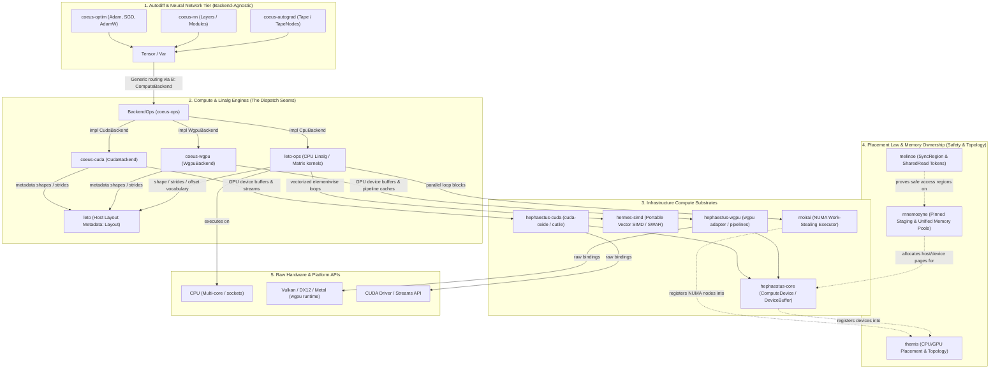

# atlas

Meta-repository aggregating independent Rust package workspaces that form one
coordinated simulation, numerics, storage, memory, and runtime stack. Each
package is a standalone Git repository, linked here as a Git submodule, and
remains independently clonable and buildable on its own.

## Model

`atlas` is an **orchestration layer**, not a Cargo workspace. A Cargo
workspace cannot contain a member that is itself a workspace, and each
submodule can be its own workspace. `atlas` therefore:

- pins each package to a specific commit via submodules (`repos/<name>`),
- drives cross-package build/test/update from one place (`scripts/`),
- documents how shared crates are consumed together.

### Shared crates

Shared crates are standalone repositories, checked out at the atlas root under
`repos/` alongside the packages that consume them.
A crate shared by multiple packages lives in one repo (single source of truth);
consuming packages depend on it by **Git remote** (tracked branch = latest), so
each package still clones and builds in isolation without vendoring the source.

Local development loop for a shared crate: edit its working copy under
`repos/<crate>`, commit and push to its remote, then in each consuming package
run `cargo update -p <crate>` to pick up the new commit.

## Atlas stack

The submodules are separate repositories, but atlas treats them as a coordinated
stack. Dependency evidence comes from each repository's `Cargo.toml` and local
README.

| Repository | Atlas role | Used by |
| --- | --- | --- |
| `CFDrs` | CFD simulation suite and primary integration consumer. It combines mesh generation, transforms, scientific output, VTK output, allocator selection, and data-parallel execution. | Consumes `gaia`, `apollo`, `consus`, `ritk`, `mnemosyne`, and `moirai`. |
| `kwavers` | Acoustic, ultrasound, elastography, therapy, imaging, PINN, and driver integration workspace. It is tracked in atlas so missing substrate capabilities can be filled in the owning provider repo before Kwavers consumes them. | Keeps `ritk` and `consus`; planned migration replaces direct `tokio`/`rayon` usage with `moirai`, direct `ndarray`/`nalgebra` usage with `leto`, direct SIMD paths with `hermes`, direct PINN `burn` usage with `coeus`, and memory placement/allocation paths with `mnemosyne` plus `themis`. |
| `gaia` | Watertight CFD mesh generation and geometry kernel. It provides the `gaia` crate, consumed as `cfd-mesh` by CFDrs and directly by RITK. | Consumed by `CFDrs` and `ritk`. Optionally bridges to `cfd-schematics`. |
| `apollo` | Fourier, spectral, number-theoretic, wavelet, and related transform implementations, with CPU, WGPU, validation, and Python crates. | Consumed by `CFDrs` for FFT/NUFFT, by `coeus` for FFT-backed tensor operations, and internally uses `moirai` in selected transform crates. |
| `consus` | Pure-Rust scientific storage formats and I/O: HDF5, Zarr, NetCDF, Parquet, Arrow, FITS, MAT, NWB, HDMF, compression, and Python bindings. | Consumed by `CFDrs` for HDF5 output and by `ritk` for HDF5/core/compression/I/O support. Uses `moirai` for parallel and native transport paths. |
| `ritk` | Medical image processing, registration, codec, and VTK workspace. It owns `ritk-vtk`, the VTK data model and I/O used by CFD output. | Consumed by `CFDrs` through `ritk-vtk`; consumes `gaia`, `moirai`, and `consus`. |
| `coeus` | Strided tensor, operations, autodiff, neural-network, sparse, optimizer, distribution, GPU, CUDA, and Python workspace. | Consumes `mnemosyne` for storage allocation, `moirai` for data-parallel execution, `hermes` for SIMD effects, and `apollo` for FFT. |
| `leto` | Shared N-dimensional strided array, layout, view, slicing, and storage vocabulary for Atlas. It is the planned replacement for direct `ndarray` usage where Apollo and Coeus need a common non-differentiable array substrate. | Intended for `apollo` and `coeus`; uses `mnemosyne` for optional aligned allocation, `moirai` for parallel operations, and `hermes` for SIMD-backed kernels. |
| `hermes` | SIMD abstraction workspace: SIMD core, intrinsics, register types, macros, examples, and benchmarks, computing over the `eunomia` datatype vocabulary. | Consumed by `coeus` and `leto` as the SIMD-effect single source of truth; consumes `eunomia` for scalar/numeric types. |
| `eunomia` | Datatype-law foundation: the single source of truth for numeric/scalar datatype vocabulary — scalar wrapper types (`F16`/`Bf16`/`F32`/…), `Complex`, packed sub-byte formats, conversion lattices, and GPU vector element types (`eunomia-gpu`). Sibling of `themis` (placement law). | Consumed by `hermes`, `leto`, `coeus`, and `hephaestus` for datatype vocabulary; depends on nothing Atlas-local. |
| `themis` | Typed placement-law crate for NUMA, HBM, memory-tier, worker, and locality-domain contracts. Sibling of `eunomia` (datatype law). | Consumed by `mnemosyne` for allocation placement and by `moirai` for scheduler topology placement. |
| `mnemosyne` | User-space allocator and memory-management workspace: core, backend, arena, local, heap, hardened, decay, profiling, C shim, and benchmarks. | Consumed by `CFDrs`, `coeus`, and `moirai`; consumes `themis` for allocation placement law and pairs conceptually with `melinoe` capability tokens. |
| `melinoe` | Branded, multi-token phantom capabilities for compile-time data-access and thread-synchronization proofs. | Supports the Mnemosyne memory ecosystem; currently tracked as a standalone foundation crate in atlas. |
| `moirai` | Concurrency, scheduling, async, parallel iteration, transport, metrics, GPU, TLS, HTTP, and Python runtime workspace. | Consumed by `CFDrs`, `coeus`, `ritk`, `consus`, and selected `apollo` crates; consumes `themis` for scheduler topology and worker placement law. |
| `hephaestus` | Shared GPU/accelerator device substrate: device/context/queue acquisition, typed device buffers, and a `ComputeDevice` dispatch seam (elementwise/scalar/unary/reduction kernels with pipeline caching) — **wgpu** backend live; **CUDA** backend planned (composing `cuda-oxide` for driver/runtime/memory/streams with `cutile` for tile/PTX kernel authoring). Sits at the infrastructure tier so spectral and tensor packages share one device layer without an `apollo`→`coeus` edge. See [ADR docs/adr/0001](docs/adr/0001-gpu-accelerator-substrate.md). | Consumed by `apollo` (`apollo-wgpu-helpers` delegates device acquisition here); `coeus` GPU backends re-base when coeus bumps to wgpu 26. Live: `leto`/`leto-ops` host-side layout SSOT + host-delegated linalg parity, `mnemosyne` device-memory pools and pinned-host staging (Stage D1), `moirai` GPU launch planning + sync primitives, `themis` placement/tiers. Planned: `melinoe` device-buffer ownership-transfer proofs; native GPU-kernel parity replacing the interim `leto-ops` host delegation. |

### Naming Conventions

Several repositories use names from classical mythology to represent their functional domains:

| Repository | Mythological Entity | Domain Mapping |
| --- | --- | --- |
| `gaia` | **Gaia** (Personification of Earth) | Geometry kernels and watertight mesh generation. |
| `apollo` | **Apollo** (God of music and harmony) | Fourier, spectral, and numerical transforms. |
| `consus` | **Consus** (Roman god of storage and grain silos) | Scientific storage formats, I/O serialization, and file transport. |
| `coeus` | **Coeus** (Titan of intellect and inquiry) | Strided tensors, neural networks, autodiff, and optimization. |
| `leto` | **Leto** (Titaness, daughter of Coeus and mother of Apollo) | Shared strided-array substrate between Coeus tensor/autodiff systems and Apollo spectral transforms. |
| `hermes` | **Hermes** (Messenger god of speed) | Low-level SIMD, register types, and vector abstractions. |
| `themis` | **Themis** (Titaness of divine law and order; mother of the Moirai) | Placement law for NUMA, HBM, memory tiers, workers, and locality domains. |
| `mnemosyne` | **Mnemosyne** (Titaness of memory) | User-space memory allocation and arena management. |
| `melinoe` | **Melinoe** (Chthonic goddess of phantoms) | Phantom capability tokens for compile-time safety and synchronization proofs. |
| `moirai` | **Moirai** (The Fates, spinners of the threads of life) | Concurrency, async task scheduling, and runtime orchestration. |
| `hephaestus` | **Hephaestus** (God of the forge and craftsmanship) | Shared GPU/accelerator device substrate (wgpu + CUDA) where compute kernels are forged. |

### Dependency flow

Current dependency flow, including direct Git dependencies and provider-mediated
Themis placement-law consumption:

```text
CFDrs
├── gaia       # CFD mesh generation
├── apollo     # FFT and NUFFT transforms
├── consus     # HDF5/scientific output
├── ritk       # VTK output through ritk-vtk
├── mnemosyne  # optional global allocator feature
└── moirai     # parallel execution

kwavers
├── ritk        # medical imaging, registration, and codec support
├── consus      # scientific storage and HDF5-style output
├── leto        # planned replacement for direct ndarray/nalgebra surfaces
├── hermes      # planned SIMD operation backend through Leto/Coeus kernels
├── coeus       # planned replacement for burn-backed PINN/autodiff paths
├── mnemosyne   # planned allocation and staging substrate
├── themis      # planned placement-law vocabulary through providers
└── moirai      # planned async/runtime and data-parallel execution substrate

coeus
├── apollo     # FFT-backed tensor operations
├── leto       # planned shared array/layout substrate
├── hermes     # SIMD abstraction
├── themis     # placement-law vocabulary through providers
├── mnemosyne  # tensor storage allocation
└── moirai     # data-parallel execution

leto
├── themis     # placement-law vocabulary through providers
├── mnemosyne  # optional aligned storage backend
├── moirai     # parallel elementwise/reduction scheduling
└── hermes     # SIMD operation backend

themis
└── melinoe     # optional branded placement scopes

ritk
├── gaia       # mesh/geometry integration
├── consus     # HDF5 and scientific I/O support
└── moirai     # data-parallel execution

consus
└── moirai     # parallelism and native transport support

apollo
├── leto        # planned ndarray replacement for array/view surfaces
├── hephaestus  # shared GPU device acquisition for the -wgpu crate family
└── moirai      # selected transform crates with parallel execution

hermes
├── mnemosyne  # NUMA-aware aligned allocation backend
└── themis     # NUMA/topology placement law

mnemosyne
├── melinoe    # branded capability tokens for arena/segment ownership
└── themis     # allocation placement law

moirai
├── melinoe    # branded writer-shard capability cells (moirai-parallel)
├── mnemosyne  # zero-copy ring-buffer allocation (feature-gated)
└── themis     # scheduler topology and worker placement law

hephaestus
├── leto        # live: host-side layout metadata reuse (Layout SSOT)
├── leto-ops    # live: host-delegated linalg parity (interim; native GPU kernels pending)
├── mnemosyne  # live (Stage D1): device-memory pools and pinned-host staging
├── moirai      # live: GPU launch planning (moirai-gpu) + sync primitives
├── themis      # live: device/placement law and tiers
└── melinoe     # planned: device-buffer ownership-transfer proofs

apollo → hephaestus             # live: apollo-wgpu-helpers delegates device acquisition
coeus  → hephaestus (planned)   # GPU tensor/autodiff backends re-base at wgpu 26 bump
```

Repositories still depend on each other through Git remotes, not by path from
the atlas root. The checked-out copies under `repos/` provide synchronized local
editing, review, and cross-package verification.

## Workspace And Crate Topology

Atlas coordinates independent package workspaces, each checked out under
`repos/`. Each repository remains separate for versioning and publishing, while
the crates form one Atlas stack through Git dependencies, shared verification
contracts, and common infrastructure crates. Below is the current topology of
each Cargo workspace and its constituent crates:

### [CFDrs](repos/CFDrs)
- **Role**: Primary computational fluid dynamics integration workspace and suite.
- **Resolver**: v2
- **Crate Catalog**:
  - [cfd-core](repos/CFDrs/crates/cfd-core): Core simulation framework, grid topology, boundary conditions, and execution loop orchestration.
  - [cfd-math](repos/CFDrs/crates/cfd-math): Numeric solver backends, sparse and dense linear algebra interfaces.
  - [cfd-io](repos/CFDrs/crates/cfd-io): Simulation format translation (VTK, OpenFOAM, CSV, HDF5).
  - [cfd-schematics](repos/CFDrs/crates/cfd-schematics): Microfluidic and millifluidic schematic and circuit vocabularies.
  - [cfd-1d](repos/CFDrs/crates/cfd-1d): One-dimensional simulation solvers.
  - [cfd-2d](repos/CFDrs/crates/cfd-2d): Two-dimensional simulation solvers.
  - [cfd-3d](repos/CFDrs/crates/cfd-3d): Three-dimensional simulation solvers.
  - [cfd-optim](repos/CFDrs/crates/cfd-optim): Design iteration, parameter optimization, and shape optimization routines.
  - [cfd-validation](repos/CFDrs/crates/cfd-validation): Benchmark analytical verification suits.
  - [cfd-python](repos/CFDrs/crates/cfd-python): PyO3 bindings for CFD solver access in Python.

### [apollo](repos/apollo)
- **Role**: High-performance transformations, spectral methods, and numerical transforms.
- **Resolver**: v2
- **Crate Catalog**:
  - [apollo-czt](repos/apollo/crates/apollo-czt): Chirp Z-Transform (CZT) CPU implementation.
  - [apollo-czt-wgpu](repos/apollo/crates/apollo-czt-wgpu): GPU-accelerated Chirp Z-Transform (CZT) via WGPU.
  - [apollo-dctdst](repos/apollo/crates/apollo-dctdst): Discrete Cosine (DCT) and Discrete Sine (DST) transforms on CPU.
  - [apollo-dctdst-wgpu](repos/apollo/crates/apollo-dctdst-wgpu): GPU-accelerated DCT and DST via WGPU.
  - [apollo-dht](repos/apollo/crates/apollo-dht): Discrete Hartley Transform (DHT) CPU implementation.
  - [apollo-dht-wgpu](repos/apollo/crates/apollo-dht-wgpu): GPU-accelerated Discrete Hartley Transform (DHT) via WGPU.
  - [apollo-fft](repos/apollo/crates/apollo-fft): Fast Fourier Transform (FFT) CPU implementation.
  - [apollo-fft-wgpu](repos/apollo/crates/apollo-fft-wgpu): GPU-accelerated Fast Fourier Transform (FFT) via WGPU.
  - [apollo-fft-macros](repos/apollo/crates/apollo-fft-macros): Procedural code-generation macros for FFT butterfly networks.
  - [apollo-frft](repos/apollo/crates/apollo-frft): Fractional Fourier Transform (FRFT) CPU implementation.
  - [apollo-frft-wgpu](repos/apollo/crates/apollo-frft-wgpu): GPU-accelerated Fractional Fourier Transform (FRFT) via WGPU.
  - [apollo-fwht](repos/apollo/crates/apollo-fwht): Fast Walsh-Hadamard Transform (FWHT) CPU implementation.
  - [apollo-fwht-wgpu](repos/apollo/crates/apollo-fwht-wgpu): GPU-accelerated Fast Walsh-Hadamard Transform (FWHT) via WGPU.
  - [apollo-gft](repos/apollo/crates/apollo-gft): Generalized and Graph Fourier Transform (GFT) CPU implementation.
  - [apollo-gft-wgpu](repos/apollo/crates/apollo-gft-wgpu): GPU-accelerated Graph Fourier Transform (GFT) via WGPU.
  - [apollo-hilbert](repos/apollo/crates/apollo-hilbert): Hilbert Transform CPU implementation for analytic signals.
  - [apollo-hilbert-wgpu](repos/apollo/crates/apollo-hilbert-wgpu): GPU-accelerated Hilbert Transform via WGPU.
  - [apollo-mellin](repos/apollo/crates/apollo-mellin): Mellin Transform CPU implementation.
  - [apollo-mellin-wgpu](repos/apollo/crates/apollo-mellin-wgpu): GPU-accelerated Mellin Transform via WGPU.
  - [apollo-ntt](repos/apollo/crates/apollo-ntt): Number-Theoretic Transform (NTT) CPU implementation over finite fields.
  - [apollo-ntt-wgpu](repos/apollo/crates/apollo-ntt-wgpu): GPU-accelerated Number-Theoretic Transform (NTT) via WGPU.
  - [apollo-nufft](repos/apollo/crates/apollo-nufft): Non-Uniform Fast Fourier Transform (NUFFT) CPU implementation.
  - [apollo-nufft-wgpu](repos/apollo/crates/apollo-nufft-wgpu): GPU-accelerated Non-Uniform Fast Fourier Transform (NUFFT) via WGPU.
  - [apollo-qft](repos/apollo/crates/apollo-qft): Quaternion Fourier Transform (QFT) CPU implementation.
  - [apollo-qft-wgpu](repos/apollo/crates/apollo-qft-wgpu): GPU-accelerated Quaternion Fourier Transform (QFT) via WGPU.
  - [apollo-radon](repos/apollo/crates/apollo-radon): Radon and Inverse Radon Transforms on CPU.
  - [apollo-radon-wgpu](repos/apollo/crates/apollo-radon-wgpu): GPU-accelerated Radon and Inverse Radon Transforms via WGPU.
  - [apollo-sdft](repos/apollo/crates/apollo-sdft): Sliding Discrete Fourier Transform (SDFT) CPU implementation for real-time analysis.
  - [apollo-sdft-wgpu](repos/apollo/crates/apollo-sdft-wgpu): GPU-accelerated Sliding Discrete Fourier Transform (SDFT) via WGPU.
  - [apollo-sft](repos/apollo/crates/apollo-sft): Sparse Fourier Transform (SFT) CPU implementation.
  - [apollo-sft-wgpu](repos/apollo/crates/apollo-sft-wgpu): GPU-accelerated Sparse Fourier Transform (SFT) via WGPU.
  - [apollo-sht](repos/apollo/crates/apollo-sht): Spherical Harmonic Transform (SHT) CPU implementation.
  - [apollo-sht-wgpu](repos/apollo/crates/apollo-sht-wgpu): GPU-accelerated Spherical Harmonic Transform (SHT) via WGPU.
  - [apollo-stft](repos/apollo/crates/apollo-stft): Short-Time Fourier Transform (STFT) CPU implementation.
  - [apollo-stft-wgpu](repos/apollo/crates/apollo-stft-wgpu): GPU-accelerated Short-Time Fourier Transform (STFT) via WGPU.
  - [apollo-validation](repos/apollo/crates/apollo-validation): Verification and error-bounds assertion engine.
  - [apollo-wavelet](repos/apollo/crates/apollo-wavelet): Continuous (CWT) and Discrete (DWT) Wavelet Transforms on CPU.
  - [apollo-wavelet-wgpu](repos/apollo/crates/apollo-wavelet-wgpu): GPU-accelerated Wavelet Transforms via WGPU.
  - [apollo-wgpu-helpers](repos/apollo/crates/apollo-wgpu-helpers): Shared GPU compute utilities, pipeline, and binder helpers.
  - [apollo-python](repos/apollo/crates/apollo-python): PyO3 bindings for python-level transform operations.

### [coeus](repos/coeus)
- **Role**: Strided tensors, automatic differentiation, neural networks, and optimizers.
- **Resolver**: v2
- **Crate Catalog**:
  - [coeus-core](repos/coeus/coeus-core): Core allocation wrappers, tensor storage definitions, backend dispatch traits.
  - [coeus-tensor](repos/coeus/coeus-tensor): Strided tensor representation, layouts, slices, and index management.
  - [coeus-ops](repos/coeus/coeus-ops): Tensor mathematical operations (broadcasting, reductions, matrix multiplies).
  - [coeus-autograd](repos/coeus/coeus-autograd): Dynamic computation graph and reverse-mode automatic differentiation.
  - [coeus-nn](repos/coeus/coeus-nn): Neural network layers, weights initialization, activations.
  - [coeus-optim](repos/coeus/coeus-optim): Model optimization algorithms (SGD, Adam, AdamW).
  - [coeus-sparse](repos/coeus/coeus-sparse): Sparse tensor layouts (CSR, CSC, COO) and sparse arithmetic.
  - [coeus-wgpu](repos/coeus/coeus-wgpu): WGPU compute shader backend.
  - [coeus-cuda](repos/coeus/coeus-cuda): NVIDIA CUDA-specific execution backend.
  - [coeus-dist](repos/coeus/coeus-dist): Distributed model training and communication primitives.
  - [coeus-python](repos/coeus/coeus-python): PyO3 bindings providing tensor interop to Python.

### [consus](repos/consus)
- **Role**: Hierarchical and array-oriented scientific storage formats.
- **Resolver**: v2
- **Crate Catalog**:
  - [consus](repos/consus/crates/consus): Unified high-level storage library facade.
  - [consus-core](repos/consus/crates/consus-core): Base node, attribute hierarchy traits, metadata schemas.
  - [consus-io](repos/consus/crates/consus-io): System and network I/O primitives.
  - [consus-compression](repos/consus/crates/consus-compression): Compression codecs (Zstd, Deflate, Lz4, etc.).
  - [consus-hdf5](repos/consus/crates/consus-hdf5): Pure-Rust HDF5 format reader and writer.
  - [consus-zarr](repos/consus/crates/consus-zarr): Pure-Rust Zarr format reader and writer.
  - [consus-netcdf](repos/consus/crates/consus-netcdf): Pure-Rust NetCDF-4 format reader and writer.
  - [consus-parquet](repos/consus/crates/consus-parquet): Parquet reader and writer.
  - [consus-arrow](repos/consus/crates/consus-arrow): Apache Arrow data structure integrations.
  - [consus-fits](repos/consus/crates/consus-fits): FITS format reader and writer.
  - [consus-mat](repos/consus/crates/consus-mat): MATLAB v5 .mat file parser and builder.
  - [consus-nwb](repos/consus/crates/consus-nwb): Neurodata Without Borders schema mapping.
  - [consus-hdmf](repos/consus/crates/consus-hdmf): Hierarchical Data Modeling Framework implementation.
  - [consus-python](repos/consus/crates/consus-python): PyO3 bindings for Python data access.

### [kwavers](repos/kwavers)
- **Role**: Acoustic simulation, therapy, imaging, driver, and PINN integration workspace.
- **Resolver**: v2
- **Atlas migration contract**: `ritk` and `consus` remain the imaging/storage providers. Replacement work is sequenced through provider-owned gaps: `moirai` for `tokio`/`rayon` runtime and parallelism, `hermes` for SIMD kernels, `leto` for `ndarray`/`nalgebra` array and linear-algebra surfaces, `coeus` for PINN/autodiff paths that currently use `burn`, and `mnemosyne`/`themis` for allocation and placement law. If a replacement provider lacks a Kwavers-required capability, the gap is fixed in the provider repo first, then Kwavers updates its pinned dependency.
- **Crate Catalog**:
  - [kwavers](repos/kwavers/crates/kwavers): High-level facade and feature orchestration crate.
  - [kwavers-core](repos/kwavers/crates/kwavers-core): Core error, unit, validation, and shared domain contracts.
  - [kwavers-math](repos/kwavers/crates/kwavers-math): Numerical kernels and math utilities for wave simulation.
  - [kwavers-signal](repos/kwavers/crates/kwavers-signal): Signal generation, sampling, and processing utilities.
  - [kwavers-grid](repos/kwavers/crates/kwavers-grid): Grid geometry and simulation-domain discretization.
  - [kwavers-field](repos/kwavers/crates/kwavers-field): Acoustic field containers and field operations.
  - [kwavers-optics](repos/kwavers/crates/kwavers-optics): Optical/acoustic coupling support.
  - [kwavers-medium](repos/kwavers/crates/kwavers-medium): Medium definitions and material-property models.
  - [kwavers-mesh](repos/kwavers/crates/kwavers-mesh): Mesh ingestion and geometry adapters.
  - [kwavers-phantom](repos/kwavers/crates/kwavers-phantom): Phantom and synthetic tissue model construction.
  - [kwavers-boundary](repos/kwavers/crates/kwavers-boundary): Boundary condition implementations.
  - [kwavers-source](repos/kwavers/crates/kwavers-source): Acoustic source and transducer-domain source contracts.
  - [kwavers-receiver](repos/kwavers/crates/kwavers-receiver): Receiver and sensor models.
  - [kwavers-transducer](repos/kwavers/crates/kwavers-transducer): Transducer geometry, steering, and propagation validation.
  - [kwavers-imaging](repos/kwavers/crates/kwavers-imaging): Imaging and reconstruction workflows.
  - [kwavers-physics](repos/kwavers/crates/kwavers-physics): Analytical physics, cavitation, and therapy-delivery models.
  - [kwavers-solver](repos/kwavers/crates/kwavers-solver): Solver adapters, PSTD/FDTD/KZK execution, and PINN solver surfaces.
  - [kwavers-analysis](repos/kwavers/crates/kwavers-analysis): Analysis workflows and quantitative validation.
  - [kwavers-simulation](repos/kwavers/crates/kwavers-simulation): Simulation orchestration and scenario execution.
  - [kwavers-diagnostics](repos/kwavers/crates/kwavers-diagnostics): Diagnostics, metrics, and reporting.
  - [kwavers-therapy](repos/kwavers/crates/kwavers-therapy): Therapy-domain models and treatment workflows.
  - [kwavers-gpu](repos/kwavers/crates/kwavers-gpu): GPU-adjacent execution surfaces and feature-gated accelerator support.
  - [kwavers-driver](repos/kwavers/crates/kwavers-driver): Device-driver, board, and experiment integration code.
  - [kwavers-python](repos/kwavers/crates/kwavers-python): Thin PyO3 bindings for Python access to Rust-owned logic.

### [gaia](repos/gaia)
- **Role**: Watertight geometry kernel and mesh generation.
- **Workspace Style**: Single-crate workspace.
- **Crate Catalog**:
  - [gaia](repos/gaia): Watertight geometry kernel, BSP trees, Delaunay triangulation, CSG Boolean operations, and millifluidic mesh generation.

### [hermes](repos/hermes)
- **Role**: Numeric and SIMD register/vector abstractions.
- **Resolver**: v2
- **Crate Catalog**:
  - [hermes-numeric](repos/hermes/crates/hermes-numeric): Scalar mathematical traits and scalar-precision bounds.
  - [hermes-simd](repos/hermes/crates/hermes-simd): Main SIMD facade for platform-independent vector operations.
  - [hermes-simd-core](repos/hermes/crates/hermes-simd-core): Architecture-agnostic SIMD API traits and constraints.
  - [hermes-simd-intrinsics](repos/hermes/crates/hermes-simd-intrinsics): Platform-specific vector intrinsic bindings (AVX2, AVX-512, Neon).
  - [hermes-simd-types](repos/hermes/crates/hermes-simd-types): Native SIMD hardware register types.
  - [hermes-simd-macros](repos/hermes/crates/hermes-simd-macros): Internal macros for register transmutations and code generation.
  - [hermes-simd-examples](repos/hermes/crates/hermes-simd-examples): Example implementations.
  - [hermes-simd-benches](repos/hermes/crates/hermes-simd-benches): SIMD lane-operation and reduction microbenchmarks.

### [leto](repos/leto)
- **Role**: Shared N-dimensional strided array vocabulary.
- **Resolver**: v2
- **Crate Catalog**:
  - [leto](repos/leto/crates/leto): N-dimensional strided array representation, slicing, layouts, and views.
  - [leto-ops](repos/leto/crates/leto-ops): Basic array mathematics, elementwise mapping, and reductions.
  - [leto-python](repos/leto/crates/leto-python): PyO3 bindings for Leto arrays.

### [melinoe](repos/melinoe)
- **Role**: Branded phantom capability tokens for compile-time safety proofs.
- **Workspace Style**: Single-crate workspace.
- **Crate Catalog**:
  - [melinoe](repos/melinoe): Zero-sized, branded capability tokens for safe cell access and thread synchronization.

### [themis](repos/themis)
- **Role**: Placement-law foundation for memory and runtime crates.
- **Workspace Style**: Single-crate workspace.
- **Crate Catalog**:
  - [themis](repos/themis): Typed NUMA node, worker, locality-domain, memory-tier, placement-hint, topology, and current-node query contracts.

### [mnemosyne](repos/mnemosyne)
- **Role**: User-space memory management and custom allocator workspace.
- **Resolver**: v2
- **Crate Catalog**:
  - [mnemosyne](repos/mnemosyne/crates/mnemosyne): Process-level global allocator configuration and setup facade.
  - [mnemosyne-core](repos/mnemosyne/crates/mnemosyne-core): Basic allocator design patterns, metrics, and tracking structures.
  - [mnemosyne-backend](repos/mnemosyne/crates/mnemosyne-backend): Virtual memory mapping and page allocation backends.
  - [mnemosyne-arena](repos/mnemosyne/crates/mnemosyne-arena): Bump, stack, and fixed-block arena allocators.
  - [mnemosyne-heap](repos/mnemosyne/crates/mnemosyne-heap): Thread-safe heap memory allocators.
  - [mnemosyne-local](repos/mnemosyne/crates/mnemosyne-local): Thread-local caching allocations to minimize contention.
  - [mnemosyne-decay](repos/mnemosyne/crates/mnemosyne-decay): Page scavenging and allocator decay strategies.
  - [mnemosyne-prof](repos/mnemosyne/crates/mnemosyne-prof): Allocation profiling, trace logging, and memory analysis.
  - [mnemosyne-hardened](repos/mnemosyne/crates/mnemosyne-hardened): Memory allocator with guard pages and double-free detection.
  - [mnemosyne-c-shim](repos/mnemosyne/crates/mnemosyne-c-shim): Standard C `malloc`/`free` FFI overrides.
  - [mnemosyne-benchmarks](repos/mnemosyne/crates/mnemosyne-benchmarks): Benchmarks checking throughput, latency, and fragmentation.

### [moirai](repos/moirai)
- **Role**: Concurrency, async task scheduler, parallel iterators, and network transport runtime.
- **Resolver**: v2
- **Crate Catalog**:
  - [moirai](repos/moirai/moirai): General runtime entrypoint and facade.
  - [moirai-core](repos/moirai/moirai-core): Runtime primitives, task queues, and control blocks.
  - [moirai-pal](repos/moirai/moirai-pal): Platform Abstraction Layer (CPU topologies, affinity, thread pinning).
  - [moirai-scheduler](repos/moirai/moirai-scheduler): Work-stealing scheduler, thread pools, and worker loops.
  - [moirai-executor](repos/moirai/moirai-executor): Async event loop and executor engine.
  - [moirai-sync](repos/moirai/moirai-sync): Synchronization structures (Mutex, Condvar, Semaphore, Channels).
  - [moirai-async](repos/moirai/moirai-async): Futures-compliant async/await executor and timer wheel.
  - [moirai-iter](repos/moirai/moirai-iter): Parallel iterator traits and adapter definitions.
  - [moirai-parallel](repos/moirai/moirai-parallel): Rayon-compatible data-parallel fork-join runtime.
  - [moirai-tls](repos/moirai/moirai-tls): Rustls-backed async Transport Layer Security over Moirai sockets.
  - [moirai-transport](repos/moirai/moirai-transport): Socket abstractions, asynchronous I/O, and platform pollers.
  - [moirai-http](repos/moirai/moirai-http): Sans-I/O HTTP/1.1 client and server engine.
  - [moirai-metrics](repos/moirai/moirai-metrics): Runtime instrumentation, queue latencies, and task counting.
  - [moirai-utils](repos/moirai/moirai-utils): Internal synchronization and utility primitives.
  - [moirai-gpu](repos/moirai/moirai-gpu): GPU execution synchronization controls.
  - [moirai-python](repos/moirai/moirai-python): PyO3 bindings for task execution in Python.

### [ritk](repos/ritk)
- **Role**: Medical image processing, format codecs, registrations, and VTK data models.
- **Resolver**: v2
- **Crate Catalog**:
  - [ritk-core](repos/ritk/crates/ritk-core): Image definitions, coordinate transforms, and pixel layout metrics.
  - [ritk-dicom](repos/ritk/crates/ritk-dicom): DICOM imaging standard parser and handler.
  - [ritk-codecs](repos/ritk/crates/ritk-codecs): Medical compression codecs (lossless JPEG, JPEG, PNG, TIFF).
  - [ritk-nifti](repos/ritk/crates/ritk-nifti): NIfTI-1 and NIfTI-2 format handlers.
  - [ritk-nrrd](repos/ritk/crates/ritk-nrrd): NRRD format parser.
  - [ritk-metaimage](repos/ritk/crates/ritk-metaimage): MetaImage format handler.
  - [ritk-mgh](repos/ritk/crates/ritk-mgh): MGH/MGZ format handler (FreeSurfer).
  - [ritk-analyze](repos/ritk/crates/ritk-analyze): Analyze 7.5 format handler.
  - [ritk-png](repos/ritk/crates/ritk-png): PNG format codec interface.
  - [ritk-jpeg](repos/ritk/crates/ritk-jpeg): JPEG format codec interface.
  - [ritk-tiff](repos/ritk/crates/ritk-tiff): TIFF format codec interface.
  - [ritk-minc](repos/ritk/crates/ritk-minc): MINC format handler.
  - [ritk-vtk](repos/ritk/crates/ritk-vtk): VTK XML data model and reader/writer.
  - [ritk-io](repos/ritk/crates/ritk-io): Unified image reader/writer interface with format autodetection.
  - [ritk-model](repos/ritk/crates/ritk-model): 3D volumetric segmentation and isosurface mesh models.
  - [ritk-registration](repos/ritk/crates/ritk-registration): Registration algorithms (affine, deformable).
  - [ritk-python](repos/ritk/crates/ritk-python): PyO3 bindings for imaging tools in Python.
  - [ritk-cli](repos/ritk/crates/ritk-cli): Command-line utility for imaging conversions.
  - [ritk-snap](repos/ritk/crates/ritk-snap): Slice visualizer and interaction shell.

## Accelerator & Compute Substrate Architecture

Here is the complete architectural layout of the `atlas` stack, showing the vertical layers from raw hardware up to the high-level neural network/autodiff tier.

### Complete Architecture & Dataflow Diagram



---

### Detailed Integration Summary

#### 1. Leto CPU Operations
* **[`leto-ops`](repos/leto/crates/leto-ops)** handles all CPU-bound execution (general matrix multiplication, shifted QR eigenvalues, full-pivoting LU).
* It optimizes CPU execution via:
  * **[`hermes-simd`](repos/hermes)**: Provides portable SIMD type vectorization across different hardware architectures (AVX, NEON) for inner loops.
  * **[`moirai`](repos/moirai)**: Performs thread-level loop partitioning and NUMA-aware scheduling for block-wise operations.
* The indexing math uses the layout vocabulary of **[`leto`](repos/leto/crates/leto)** to correctly parse strided and sliced matrices.

#### 2. Hephaestus GPU Substrate
The low-level GPU acceleration substrate is split into three parts:
* **[`hephaestus-core`](repos/hephaestus/crates/hephaestus-core)**: The central device/buffer interface traits.
* **[`hephaestus-wgpu`](repos/hephaestus/crates/hephaestus-wgpu)**: The WebGPU backend, using WGSL shaders compiled and dispatched on-the-fly.
* **`hephaestus-cuda` (planned sibling crate)**: Composes:
  * `cuda-oxide` for driver, device stream, and CUDA context management.
  * `cutile` for tiled PTX/CUDA kernel compilation and dispatch.

> [!NOTE]
> **Hephaestus as the GPU Substrate (CuPy-Analogy)**: Much like **[`leto`](repos/leto)** serves as the CPU-bound non-differentiable array vocabulary, **[`hephaestus`](repos/hephaestus)** serves as the shared GPU/accelerator buffer and compute substrate. It decouples high-level packages (such as `apollo` spectral transforms and `coeus` tensor backends) so they can share device contexts and memory allocations without direct dependencies, conceptually mirroring the role of **CuPy** in the Python (NumPy/SciPy) ecosystem.

#### 3. Coeus GPU Tensors
* The tensor engine **[`coeus`](repos/coeus)** defines the generic `Tensor<T, B>` (and taped `Var<T, B>`).
* If `B` is `WgpuBackend` or `CudaBackend`, tensor allocations and operations route through `coeus-wgpu` or `coeus-cuda`.
* These crates translate tensor layouts ([`Layout<N>`](repos/leto/crates/leto/src/domain/layout/mod.rs) from `leto`) into GPU buffers, dispatching shaders over `hephaestus-wgpu` or `hephaestus-cuda` to run GPU calculations without copy overhead.

#### 4. Kwavers Domain Integration
* **[`kwavers`](repos/kwavers)** is a domain/integrator workspace in the same Atlas submodule set as CFDrs. It can now build under `D:/atlas/target` when invoked from `repos/kwavers`, through the shared `repos/.cargo/config.toml` target-dir policy.
* Kwavers keeps **[`ritk`](repos/ritk)** for imaging/registration and **[`consus`](repos/consus)** for scientific storage.
* Migration work proceeds provider-first: missing array or linear-algebra capability is added to **[`leto`](repos/leto)**, missing SIMD capability to **[`hermes`](repos/hermes)**, missing PINN/autodiff capability to **[`coeus`](repos/coeus)**, missing runtime/parallel capability to **[`moirai`](repos/moirai)**, and missing allocator/placement capability to **[`mnemosyne`](repos/mnemosyne)** or **[`themis`](repos/themis)** before Kwavers updates its dependency pins.
* Provider-specific GPU errors, device acquisition, buffers, and kernel dispatch stay in **[`hephaestus`](repos/hephaestus)**, **[`coeus`](repos/coeus)**, or Kwavers' feature-gated GPU leaf crates. Foundational Kwavers crates must not grow WGPU/CUDA-specific conversion features just to make downstream `?` propagation compile.

## Zero-Copy and Modularity Invariants

The Atlas stack enforces strict performance, memory efficiency, and structural modularity contracts across its packages (notably `apollo` and its GPU backend integrations):

- **Zero-Copy Cow Promotion**: All typed execution boundaries (e.g., `execute_*_typed_into` and `*_typed` helpers) route inputs and outputs through `std::borrow::Cow` and dynamically check representations via `std::any::TypeId`. When layouts match the compute backend's internal layout (e.g. `f32` or `Complex32`), unsafe reinterpretation casts bypass heap allocation and quantization loops.
- **Staging Buffer Pooling & Pipeline Caching**: Concrete GPU backends query a thread-safe compute pipeline cache (`pipeline_cache` in the shared `hephaestus-wgpu` substrate) to avoid recompilation on shader execution. GPU host-staging transfers reuse recycled staging buffers through `WgpuDevice`'s staging pool helper.
- **Modularity Limits (500-Line Rule)**: Every source file in the workspaces targets a maximum of 500 lines. Monolithic files exceeding this limit (e.g., `device.rs` and `kernel.rs` in WGPU transform crates) are refactored into structured sub-folders (such as `device/forward.rs`, `device/inverse.rs`, `device/helpers.rs`) and extend the parent struct definitions via decentralized `impl` blocks.

## Layout

```
atlas/
├── repos/
│   ├── apollo/           # Fourier transform planning and execution workspace
│   ├── CFDrs/            # computational fluid dynamics simulation workspace
│   ├── coeus/            # strided tensor library workspace
│   ├── consus/           # scientific storage-format workspace
│   ├── gaia/             # watertight CFD mesh-generation workspace
│   ├── hermes/           # SIMD abstraction workspace
│   ├── kwavers/          # acoustic simulation and therapy integration workspace
│   ├── leto/             # shared N-dimensional strided array workspace
│   ├── melinoe/          # branded phantom-capability foundation crate
│   ├── themis/           # placement-law foundation crate
│   ├── mnemosyne/        # user-space memory allocator workspace
│   ├── moirai/           # concurrency library workspace
│   └── ritk/             # medical image processing and registration workspace
├── scripts/              # cross-package orchestration
├── .gitmodules
└── README.md
```

`.gitmodules` is the authoritative source for submodule remotes and tracked
branches.

## Clone

Submodules are nested, so clone recursively:

```sh
git clone --recurse-submodules https://github.com/<owner>/atlas.git
# or, after a plain clone:
git submodule update --init --recursive
```

## Working with packages

```sh
# Build / test a single package from inside repos/<name>.
# This lets Cargo discover repos/.cargo/config.toml and reuse D:/atlas/target.
cd repos/CFDrs
cargo build
cargo nextest run
cd ../..

# Build every package
pwsh scripts/build-all.ps1     # Windows: cargo build
./scripts/build-all.sh         # Unix: cargo build

# Test every package
pwsh scripts/build-all.ps1 test
./scripts/build-all.sh test

# Run another Cargo subcommand across every package
pwsh scripts/build-all.ps1 clippy --all-targets --all-features -- -D warnings
./scripts/build-all.sh clippy --all-targets --all-features -- -D warnings

# Pull the latest commit of every submodule
git submodule update --remote --recursive
```

## Adding a package

```sh
git submodule add <url> repos/<name>
git submodule update --init --recursive
git commit -m "atlas: add <name> package"
```
