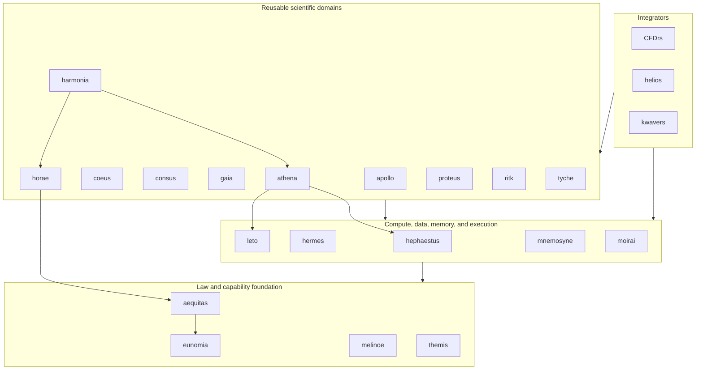

# atlas

Meta-repository for the Rust workspaces that form the Atlas multiphysics
simulation stack. Atlas coordinates numeric laws, memory and execution
providers, reusable scientific domains, and end-user simulation suites without
collapsing their independent release histories.

## Repository model

`atlas` is an orchestration repository, not a Cargo workspace. Each package is
an independent Git repository mounted at `repos/<name>` as a submodule.

The root repository owns:

- the exact package set and remotes in [`.gitmodules`](.gitmodules);
- a reproducible stack revision through the recorded submodule gitlinks;
- cross-package build and verification drivers in [`scripts/`](scripts);
- stack-wide architecture decisions in [`docs/adr/`](docs/adr).

Each package owns its crate topology, direct dependencies, lockfile, tests,
release policy, and detailed documentation. The package's `Cargo.toml` and
`Cargo.lock` are authoritative for direct dependency edges; this README
documents bounded-context ownership and must not be read as an exact Cargo
dependency graph.

Shared first-party capabilities follow provider-first ownership. A missing
operation is implemented in the provider that owns its bounded context, then
consumers update their pins. Consumer-local compatibility layers and duplicate
provider implementations are not part of the Atlas model.

### Revision contract

The parent gitlink is the reproducible package revision. A local package
checkout may temporarily point elsewhere or contain uncommitted work without
changing the Atlas revision. Use `git diff --submodule=log` to distinguish a
published child commit from modified child content, and never advance a
gitlink solely to make the parent working tree appear clean.

Directories below `repos/` that are absent from `.gitmodules` are not part of
the recorded stack. They are local work until they independently satisfy the
[promotion gate](#promotion-gate) and enter Atlas through a reviewed submodule
addition.

## Current stack

At this revision, [`.gitmodules`](.gitmodules) records 22 packages.

| Layer | Repository | Canonical role |
| --- | --- | --- |
| Integrator | [`CFDrs`](repos/CFDrs) | Computational fluid dynamics, coupled flow simulation, validation, and scientific output. |
| Integrator | [`helios`](repos/helios) | Radiation-therapy dose, planning, imaging, and delivery simulation. |
| Integrator | [`kwavers`](repos/kwavers) | Acoustic, ultrasound, therapy, imaging, and coupled wave simulation. |
| Domain | [`apollo`](repos/apollo) | Fourier, spectral, wavelet, number-theoretic, and related transforms. |
| Domain | [`athena`](repos/athena) | Backend-neutral PCG and restarted GMRES over Leto CPU and Hephaestus WGPU execution. |
| Domain | [`coeus`](repos/coeus) | Strided tensors, automatic differentiation, neural networks, optimization, and sparse operations. |
| Domain | [`consus`](repos/consus) | Native scientific storage formats, compression, and data transport. |
| Domain | [`gaia`](repos/gaia) | Geometry predicates, topology, watertight meshes, and mesh generation. |
| Domain | [`harmonia`](repos/harmonia) | Transactional partitioned multiphysics coupling, interface transfer, relaxation, and heterogeneous subcycling. |
| Domain | [`horae`](repos/horae) | Typed simulation time, explicit integration, adaptive policy, event clipping, and subcycle ratios. |
| Domain | [`proteus`](repos/proteus) | Validated material-property, material-identity, and static constitutive-law vocabulary parameterized by Aequitas quantities and Eunomia scalars. |
| Domain | [`ritk`](repos/ritk) | Medical-image formats, processing, registration, visualization, and VTK data models. |
| Domain | [`tyche`](repos/tyche) | Uncertainty quantification, sampling, ensembles, sensitivity, and reproducible stochastic studies over Moirai execution and Consus persistence. |
| Compute | [`hephaestus`](repos/hephaestus) | GPU device, buffer, transfer, and kernel substrate for WGPU and CUDA. |
| Compute | [`hermes`](repos/hermes) | CPU SIMD/SWAR vocabulary, ISA dispatch, and vector kernels. |
| Compute | [`leto`](repos/leto) | N-dimensional host arrays, layouts, views, operations, and linear algebra. |
| Compute | [`mnemosyne`](repos/mnemosyne) | Allocation, arenas, heaps, staging memory, and allocator instrumentation. |
| Compute | [`moirai`](repos/moirai) | Scheduling, parallel iteration, async execution, synchronization, and transport. |
| Foundation | [`aequitas`](repos/aequitas) | Physical-quantity law: type-level SI dimensions, transparent quantities, and linear-unit conversion over Eunomia scalars. |
| Foundation | [`eunomia`](repos/eunomia) | Datatype law: scalar, complex, packed, conversion, and numeric-trait vocabulary. |
| Foundation | [`melinoe`](repos/melinoe) | Branded capability evidence for memory access and synchronization. |
| Foundation | [`themis`](repos/themis) | Placement law for NUMA nodes, workers, locality domains, and memory tiers. |

The diagram is a layer map, not a literal manifest graph. Higher layers consume
contracts owned below them, and a package may legitimately skip an intermediate
layer.



### Provider ownership

| Concern | Owner | Boundary |
| --- | --- | --- |
| Physical quantities and dimensional law | `aequitas` | Owns dimensions and linear units over Eunomia scalars, not scalar representations or domain validity. |
| Numeric representations and scalar laws | `eunomia` | Owns datatype vocabulary, not algorithms or storage. |
| Placement and locality law | `themis` | Owns typed placement facts, not allocation or scheduling. |
| Capability proofs | `melinoe` | Owns branded access evidence, not memory management. |
| Allocation and memory policy | `mnemosyne` | Owns host allocation, arenas, heaps, and staging memory. |
| Execution and transport | `moirai` | Owns scheduling, parallelism, async execution, synchronization, and transport. |
| CPU lane-parallel execution | `hermes` | Owns SIMD/SWAR kernels and runtime ISA selection. |
| Host arrays and linear algebra | `leto` | Owns layouts, views, array operations, and CPU linear algebra. |
| Accelerator execution | `hephaestus` | Owns GPU devices, buffers, transfers, pipelines, and provider kernels. |
| Time-integration policy | `horae` | Owns typed simulation time, explicit stepping, adaptive decisions, event clipping, and subcycle ratios; equations remain in domain packages. |
| Iterative solver policy | `athena` | Owns Krylov recurrences, operator/preconditioner contracts, convergence, workspaces, and reports over Leto CPU and Hephaestus GPU execution. |
| Multiphysics coupling | `harmonia` | Owns partitioned coupling iteration, interface transfer, relaxation, and transactional state exchange; physics models, time law, and convergence policy remain with their providers. |
| Spectral transforms | `apollo` | Owns transform mathematics and plans; accelerator mechanics remain in Hephaestus. |
| Tensors and autodiff | `coeus` | Owns tensor semantics, differentiation, neural-network operations, and optimizers. |
| Geometry and meshes | `gaia` | Owns geometric predicates, topology, and mesh generation. |
| Scientific persistence | `consus` | Owns storage formats, compression, and persistent scientific data exchange. |
| Medical imaging | `ritk` | Owns image formats, processing, registration, and VTK data models. |
| Material properties | `proteus` | Owns validated material properties, material identity, and static constitutive-law contracts over Aequitas quantities and Eunomia scalars. |
| Uncertainty quantification | `tyche` | Owns sampling, statistics, sensitivity, ensemble, and reproducible study vocabulary over Moirai execution and Consus persistence. |

The accepted GPU boundary is recorded in
[ADR 0001](docs/adr/0001-gpu-accelerator-substrate.md). The reproducible
provider-pin contract and its evidence limits are recorded in
[ADR 0020](docs/adr/0020-provider-graph-refresh.md). Aequitas ownership and
consumer-boundary integration are recorded in
[ADR 0021](docs/adr/0021-aequitas-quantity-law-foundation.md).
Horae and Athena's extraction, backend, and promotion boundaries are recorded
in [ADR 0022](docs/adr/0022-horae-athena-provider-extraction.md).
Harmonia's Phase 0 coupling boundary and promotion evidence are recorded in
[ADR 0023](docs/adr/0023-harmonia-coupling-promotion.md).

## Naming

Classical names describe bounded contexts rather than implementation variants.

| Repository | Classical reference | Mapping |
| --- | --- | --- |
| `atlas` | Atlas, the Titan who bears the heavens | Coordinates the independently versioned stack. |
| `aequitas` | Aequitas, Roman personification of equity and fair measure | Physical quantities, units, and dimensional law. |
| `apollo` | Apollo, associated with music and ordered harmony | Spectral and numerical transforms. |
| `athena` | Athena, goddess of wisdom and strategy | Iterative solver policy over CPU and accelerator providers. |
| `coeus` | Coeus, Titan associated with intellect and inquiry | Tensor computation and learning systems. |
| `consus` | Consus, Roman god associated with stored grain | Scientific storage and persistence. |
| `eunomia` | Eunomia, goddess of good order | Datatype laws and conversion order. |
| `gaia` | Gaia, personification of Earth | Geometry, topology, and meshes. |
| `harmonia` | Harmonia, goddess of harmony and concord | Multiphysics coupling mechanics. |
| `helios` | Helios, personification of the Sun | Radiation and imaging simulation. |
| `hephaestus` | Hephaestus, god of the forge | Accelerator devices and kernels. |
| `hermes` | Hermes, swift messenger god | SIMD dispatch and vector execution. |
| `horae` | The Horae, goddesses of seasons and ordered time | Time integration, event clocks, and subcycle policy. |
| `leto` | Leto, mother of Apollo and daughter of Coeus | Shared array substrate between transform and tensor domains. |
| `melinoe` | Melinoe, an underworld goddess associated with phantoms | Zero-sized phantom capability evidence. |
| `mnemosyne` | Mnemosyne, Titaness of memory | Allocation and memory management. |
| `moirai` | The Moirai, who govern the threads of fate | Scheduling and execution of program threads. |
| `themis` | Themis, Titaness of divine law and order | Placement and locality law. |

`CFDrs`, `kwavers`, and `ritk` retain descriptive project names. New
repositories use a classical name only when the mapping clarifies a stable
bounded context.

## Future package roadmap

The following names are architectural candidates, not current submodules,
published crates, or implementation commitments. Names remain provisional
until repository and crate-name availability is checked. No empty repository
should be created from this list: promotion requires a real vertical
implementation extracted from an existing need.

### Promotion gate

A candidate becomes an Atlas package only when all of these conditions hold:

1. At least two packages need the capability, or an existing implementation is
   already in the wrong dependency layer.
2. A source audit proves that no current provider owns the same bounded context.
3. An ADR defines the contract, dependency direction, migration, non-goals, and
   conformance or differential oracle.
4. The first change moves real computation into the new owner, migrates every
   in-scope caller, and deletes the superseded implementation.
5. The package is independently versioned or consumed across repository
   boundaries; otherwise it remains a module or crate in the current owner.
6. `.gitmodules`, this stack table, affected provider documentation, and
   cross-package verification move in the same delivery unit.

### Candidate packages

Harmonia graduated from this roadmap through
[ADR 0023](docs/adr/0023-harmonia-coupling-promotion.md). Proteus graduated
as a registered submodule (material-property foundation, v0.1.0). Tyche
graduated as a registered submodule (UQ foundation, v0.1.0). The
remaining candidates are:

| Priority | Working name | Classical reference | Proposed bounded context | Current drivers |
| --- | --- | --- | --- | --- |
| P1 | `asclepius` | Asclepius, god of medicine and healing | Biological-response, tissue-effect, treatment-response, and therapy outcome models. | Helios and Kwavers share treatment and tissue-response concerns; RITK supplies imaging inputs. |
| P2 | `iris` | Iris, messenger goddess associated with the rainbow | Domain-neutral visualization, diagnostic views, and render/plot contracts. File formats remain with RITK or Consus. | Simulation and validation outputs need a common presentation boundary. |
| P2 | `ares` | Ares, god of war | Solid mechanics, deformation, contact, and fluid-structure interaction. | Elastography and coupled CFD can provide the first two consumers. |
| P2 | `hyperion` | Hyperion, Titan associated with heavenly light | Electromagnetic, optical, and radiation-transport operators. | Kwavers and Helios contain adjacent wave and radiation concerns. |
| P2 | `prometheus` | Prometheus, Titan associated with fire and craft | Thermochemistry, reactions, combustion, and reactive transport. | Reactive-flow and thermal-therapy work can establish the shared contract. |

### Dependency order

The recommended extraction order is:

```text
eunomia
└── aequitas
    ├── horae
    └── proteus

eunomia + leto + hephaestus
└── athena

horae + athena ── harmonia ───┐
proteus ──────────────────────┼── CFDrs / helios / kwavers
domain physics ───────────────┘

moirai + consus ── tyche
coeus + aequitas ── asclepius
domain result views ── iris
```

`harmonia` follows typed time and convergence contracts but does not depend on
material law or own physics. Its Phase 0 API provides two-partition synchronous
Jacobi coupling over Horae subcycle plans and Athena Core convergence policy.
Integrators compose those mechanics with `proteus` or domain-owned
constitutive models. `ares`, `hyperion`, and `prometheus` remain domain-level
candidates until two concrete consumers justify extraction.

The following concerns are not package gaps:

- arrays, layouts, views, and host linear algebra belong to `leto`;
- GPU devices, buffers, transfers, and kernels belong to `hephaestus`;
- scheduling, async execution, synchronization, and transport belong to
  `moirai`;
- SIMD and SWAR execution belongs to `hermes`;
- allocation and staging memory belongs to `mnemosyne`;
- geometry and mesh generation belongs to `gaia`;
- scientific storage and checkpoint persistence belongs to `consus`.

## Layout

```text
atlas/
├── docs/
│   └── adr/              # stack-wide architectural decisions
├── repos/
│   ├── CFDrs/
│   ├── aequitas/
│   ├── apollo/
│   ├── athena/
│   ├── coeus/
│   ├── consus/
│   ├── eunomia/
│   ├── gaia/
│   ├── helios/
│   ├── hephaestus/
│   ├── hermes/
│   ├── horae/
│   ├── kwavers/
│   ├── leto/
│   ├── melinoe/
│   ├── mnemosyne/
│   ├── moirai/
│   ├── ritk/
│   └── themis/
├── scripts/              # cross-package orchestration
├── .gitmodules
└── README.md
```

## Clone

```sh
git clone --recurse-submodules https://github.com/ryancinsight/atlas.git
cd atlas
```

After a non-recursive clone:

```sh
git submodule update --init --recursive
```

## Work with packages

Build or test one package from its repository:

```sh
cd repos/CFDrs
cargo build
cargo nextest run
cargo test --doc
```

Run the same Cargo command across every package recorded in `.gitmodules`.
The driver fails if a recorded submodule is not initialized instead of
silently omitting it:

```sh
# Windows
pwsh scripts/build-all.ps1
pwsh scripts/build-all.ps1 nextest run
pwsh scripts/build-all.ps1 test --doc
pwsh scripts/build-all.ps1 clippy --all-targets -- -D warnings

# Unix
./scripts/build-all.sh
./scripts/build-all.sh nextest run
./scripts/build-all.sh test --doc
./scripts/build-all.sh clippy --all-targets -- -D warnings
```

Update the checkout to the commits recorded by the parent repository:

```sh
git submodule update --init --recursive
```

Inspect local package state before cleanup or integration:

```sh
git submodule status
git diff --submodule=log
git submodule foreach --recursive 'git status --short --branch'
```

In `git submodule status`, a leading space matches the recorded gitlink, `+`
means the package is checked out at another commit, and `-` means it is not
initialized; `U` identifies a gitlink merge conflict. Modified content is
reported separately by `git status` and must be preserved or completed in the
owning package. After verifying that a clean alternate checkout is already
contained in the recorded commit, restore only that package with:

```sh
git submodule update --checkout -- repos/<name>
```

Advancing package pins is a reviewed provider-graph change. Fetch and verify
the package's remote default branch, update its gitlink, run the affected
provider and consumer gates, and commit the parent pointer only after the child
revision is published.

### Benchmark regression gate

Atlas owns the cross-package Criterion comparison policy in
[`tools/criterion-regression`](tools/criterion-regression). Package CI runs a
saved baseline at the pull request base revision and a comparison at the head
revision on the same runner. The gate fails on a wholly positive relative
median-change confidence interval or a missing comparison; it has no
duplicated package scripts or arbitrary percentage threshold.

## Add a package

A package must pass the [promotion gate](#promotion-gate) before it enters the
meta-repository.

```sh
git submodule add <url> repos/<name>
git submodule update --init --recursive
git commit -m "feat(atlas): Add <name> package"
```
