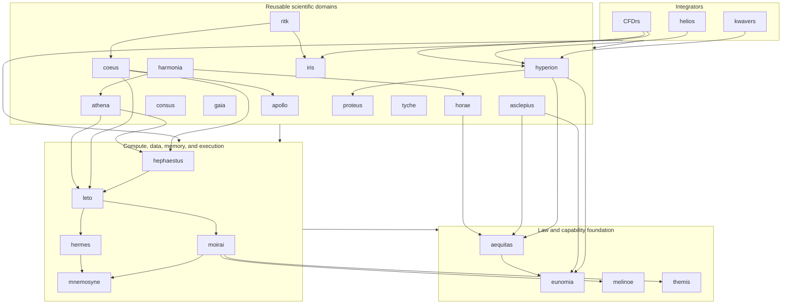

# atlas

Meta-repository for the Rust workspaces that form the Atlas multiphysics
simulation stack. Atlas coordinates numeric laws, memory and execution
providers, reusable scientific domains, and end-user simulation suites without
collapsing their independent release histories.

The delivered suite simulates **radiation transport and therapy**, **fluid
dynamics**, and **acoustics and ultrasound**, with **optical transport** shared
across them. Each modality is an integrator over the same providers rather than
a self-contained program: a modality contributes its transport stage, and the
deposition, bioheat, damage, and planning stages behind that stage are shared
(see [Modality boundary decision](#modality-boundary-decision)). Everything
below the integrators is Rust; Python exists only as a thin PyO3 binding surface
over a Rust core.

## Substrate composition

The stack is built from first-party substrate crates rather than the usual
third-party equivalents, so one owner exists per bounded context and the
provider graph stays acyclic. Ownership is enforced by the
[promotion gate](#promotion-gate) and the [provider table](#provider-ownership);
the equivalence column below states what a package displaces, not an API
compatibility promise.

| Concern | Atlas owner | Displaces |
| --- | --- | --- |
| Allocation, arenas, staging memory | `mnemosyne` | ad-hoc global allocation and per-crate pools |
| Scheduling, parallel iteration, async, transport | `moirai` | `rayon` and `tokio` |
| CPU lane-parallel kernels and ISA dispatch | `hermes` | hand-written intrinsics and per-ISA crates |
| Host arrays, layouts, views, linear algebra | `leto` | `ndarray` and its linear-algebra satellites |
| Accelerator devices, buffers, kernels | `hephaestus` | direct `wgpu`/CUDA orchestration in domain code |
| Transforms (Fourier, spectral, wavelet, NTT) | `apollo` | `rustfft` and FFTW-family bindings |
| Tensors, autodiff, neural networks, optimizers | `coeus` | `burn`, JAX, PyTorch, and MLX |
| Medical image formats, processing, registration | `ritk` | VTK, ITK, MITK, and SimpleITK |

`leto` and `hephaestus` are not alternatives to each other. They are the CPU and
accelerator backends of the same `ComputeBackend` seam, and are normally used
together: `coeus` binds both through zero-cost generic dispatch, so one tensor
program monomorphizes to either backend without a runtime vtable and without a
cloned per-backend algorithm. The two are layered rather than parallel —
`hephaestus` depends on `leto` for host-side staging arrays — so selecting the
accelerator backend never removes the host array substrate from the build.

`coeus` consumes `apollo` rather than reimplementing transforms. Apollo owns the
forward and inverse transform mathematics and plans; Coeus adds the
differentiation layer on top, so a transform inside a differentiated program has
one implementation and one set of adjoint rules.

**The vendor dimension belongs to `hephaestus` alone.** A consumer binds a
device-generic seam — `DenseVectorOps`, `SparseOperatorOps`, `AxisReductionOps`,
and the families following them — and monomorphizes to whichever backend it was
given. Per-vendor code in a consumer is limited to device acquisition; a consumer
that carries one crate per vendor for operations the substrate already provides
has re-forked the dimension the substrate exists to own.
[ADR 0039](docs/adr/0039-compute-substrate-topology.md) records the topology
across these four packages, the audit behind it, and the sequence that closes the
gap — seam coverage in Hephaestus first, consumer collapse second, because the
reverse order would make a consumer invent a second abstraction over the first.

`ritk` runs on `coeus` tensors. Its former `burn` dependency is fully retired —
the current `ritk` manifests contain no `burn` edge, and `ritk-core`,
`ritk-analyze`, and `ritk-cli` depend on `coeus-core` directly.

```text
memory       execution    CPU lanes   host arrays   accelerator
mnemosyne ──> moirai ───> hermes ───> leto ───────> hephaestus
                                        │               │
                                        └───────┬───────┘
                                                v
                                    apollo ──> coeus ──> ritk
                                              tensors +
                                              autodiff
```

## Repository model

`atlas` is an orchestration repository, not a Cargo workspace. Each package is
an independent Git repository mounted at `repos/<name>` as a submodule.

The root repository owns:

- the exact package set and remotes in [`.gitmodules`](.gitmodules);
- a reproducible stack revision through the recorded submodule gitlinks;
- cross-package build and verification drivers in [`scripts/`](scripts);
- stack-wide architecture decisions in [`docs/adr/`](docs/adr).

Each package owns its crate topology, direct dependencies, lockfile, tests,
release policy, and detailed documentation. The package's `Cargo.toml` and
`Cargo.lock` are authoritative for direct dependency edges; this README
documents bounded-context ownership and must not be read as an exact Cargo
dependency graph.

Shared first-party capabilities follow provider-first ownership. A missing
operation is implemented in the provider that owns its bounded context, then
consumers update their pins. Consumer-local compatibility layers and duplicate
provider implementations are not part of the Atlas model.

### Revision contract

The parent gitlink is the reproducible package revision. A local package
checkout may temporarily point elsewhere or contain uncommitted work without
changing the Atlas revision. Use `git diff --submodule=log` to distinguish a
published child commit from modified child content, and never advance a
gitlink solely to make the parent working tree appear clean.

Directories below `repos/` that are absent from `.gitmodules` are not part of
the recorded stack. They are local work until they independently satisfy the
[promotion gate](#promotion-gate) and enter Atlas through a reviewed submodule
addition.

## Current stack

At this revision, [`.gitmodules`](.gitmodules) records 25 packages.

| Layer | Repository | Canonical role |
| --- | --- | --- |
| Integrator | [`CFDrs`](repos/CFDrs) | Computational fluid dynamics, coupled flow simulation, validation, and scientific output. |
| Integrator | [`helios`](repos/helios) | Radiation-therapy dose, planning, imaging, and delivery simulation. |
| Integrator | [`kwavers`](repos/kwavers) | Acoustic, ultrasound, therapy, imaging, and coupled wave simulation. |
| Domain | [`apollo`](repos/apollo) | Fourier, spectral, wavelet, number-theoretic, and related transforms. |
| Domain | [`asclepius`](repos/asclepius) | Biological-response, tissue-effect, treatment-response, and therapy-outcome laws over Aequitas quantities and Eunomia scalars, with a one-way Coeus adapter. |
| Domain | [`athena`](repos/athena) | Backend-neutral PCG and restarted GMRES over Leto CPU and Hephaestus WGPU execution. |
| Domain | [`coeus`](repos/coeus) | Strided tensors, automatic differentiation, neural networks, optimization, and sparse operations over the Leto CPU and Hephaestus accelerator backends, with Apollo transforms differentiated in place. |
| Domain | [`consus`](repos/consus) | Native scientific storage formats, compression, and data transport. |
| Domain | [`gaia`](repos/gaia) | Geometry predicates, topology, watertight meshes, and mesh generation. |
| Domain | [`harmonia`](repos/harmonia) | Transactional partitioned multiphysics coupling, interface transfer, relaxation, and heterogeneous subcycling. |
| Domain | [`hyperion`](repos/hyperion) | Validated photon and optical interaction coefficients, optical depth, Beer-Lambert transmission, derived transport laws, and bounded attenuation reference data. |
| Domain | [`horae`](repos/horae) | Typed simulation time, explicit integration, adaptive policy, event clipping, and subcycle ratios. |
| Domain | [`iris`](repos/iris) | Domain-neutral normalized colors, fixed lookup tables, borrowed diagnostic views, and render-backend contracts. |
| Domain | [`proteus`](repos/proteus) | Validated material-property, material-identity, and static constitutive-law vocabulary parameterized by Aequitas quantities and Eunomia scalars. |
| Domain | [`ritk`](repos/ritk) | Medical-image formats, processing, registration, domain-specific visualization, and VTK data models over Coeus tensors. |
| Domain | [`tyche`](repos/tyche) | Uncertainty quantification, sampling, ensembles, sensitivity, and reproducible stochastic studies over Moirai execution and Consus persistence. |
| Compute | [`hephaestus`](repos/hephaestus) | GPU device, buffer, transfer, and kernel substrate for WGPU and CUDA. |
| Compute | [`hermes`](repos/hermes) | CPU SIMD/SWAR vocabulary, ISA dispatch, and vector kernels. |
| Compute | [`leto`](repos/leto) | N-dimensional host arrays, layouts, views, operations, and linear algebra. |
| Compute | [`mnemosyne`](repos/mnemosyne) | Allocation, arenas, heaps, staging memory, and allocator instrumentation. |
| Compute | [`moirai`](repos/moirai) | Scheduling, parallel iteration, async execution, synchronization, and transport. |
| Foundation | [`aequitas`](repos/aequitas) | Physical-quantity law: type-level SI dimensions, transparent quantities, and linear-unit conversion over Eunomia scalars. |
| Foundation | [`eunomia`](repos/eunomia) | Datatype law: scalar, complex, packed, conversion, and numeric-trait vocabulary. |
| Foundation | [`melinoe`](repos/melinoe) | Branded capability evidence for memory access and synchronization. |
| Foundation | [`themis`](repos/themis) | Placement law for NUMA nodes, workers, locality domains, and memory tiers. |

The diagram is a layer map, not a literal manifest graph. Higher layers consume
contracts owned below them, and a package may legitimately skip an intermediate
layer.


```mermaid
flowchart TB
    subgraph Integrators
        CFDrs
        helios
        kwavers
    end

    subgraph Domains["Reusable scientific domains"]
        apollo
        asclepius
        coeus
        consus
        gaia
        harmonia
        hyperion
        horae
        iris
        athena
        proteus
        ritk
        tyche
    end

    subgraph Compute["Compute, data, memory, and execution"]
        hephaestus
        hermes
        leto
        mnemosyne
        moirai
    end

    subgraph Foundation["Law and capability foundation"]
        aequitas
        eunomia
        melinoe
        themis
    end

    Integrators --> Domains
    Integrators --> Compute
    Domains --> Compute
    Compute --> Foundation
    aequitas --> eunomia
    horae --> aequitas
    athena --> leto
    athena --> hephaestus
    harmonia --> horae
    harmonia --> athena
    asclepius --> aequitas
    asclepius --> eunomia
    hyperion --> aequitas
    hyperion --> eunomia
    hyperion --> proteus
    CFDrs --> hyperion
    helios --> hyperion
    kwavers --> hyperion
    ritk --> iris
    CFDrs --> iris
    coeus --> apollo
    coeus --> leto
    coeus --> hephaestus
    ritk --> coeus
    hephaestus --> leto
    leto --> hermes
    leto --> moirai
    hermes --> mnemosyne
    moirai --> mnemosyne
    moirai --> melinoe
    moirai --> themis
```

The substrate edges above are read from the package manifests at this revision:
`coeus` depends on `apollo-fft`, `leto`/`leto-ops`, and the `hephaestus-*`
provider crates; `ritk` depends on `coeus-core`; `hephaestus` depends on `leto`
for host-side staging arrays, so the two backends are layered rather than
parallel.

### Provider ownership

| Concern | Owner | Boundary |
| --- | --- | --- |
| Physical quantities and dimensional law | `aequitas` | Owns dimensions and linear units over Eunomia scalars, not scalar representations or domain validity. |
| Numeric representations and scalar laws | `eunomia` | Owns datatype vocabulary, not algorithms or storage. |
| Placement and locality law | `themis` | Owns typed placement facts, not allocation or scheduling. |
| Capability proofs | `melinoe` | Owns branded access evidence, not memory management. |
| Allocation and memory policy | `mnemosyne` | Owns host allocation, arenas, heaps, and staging memory. |
| Execution and transport | `moirai` | Owns scheduling, parallelism, async execution, synchronization, and transport. |
| CPU lane-parallel execution | `hermes` | Owns SIMD/SWAR kernels and runtime ISA selection. |
| Host arrays and linear algebra | `leto` | Owns layouts, views, array operations, and CPU linear algebra. |
| Accelerator execution | `hephaestus` | Owns GPU devices, buffers, transfers, pipelines, and provider kernels. |
| Time-integration policy | `horae` | Owns typed simulation time, explicit stepping, adaptive decisions, event clipping, and subcycle ratios; equations remain in domain packages. |
| Iterative solver policy | `athena` | Owns Krylov recurrences, operator/preconditioner contracts, convergence, workspaces, and reports over Leto CPU and Hephaestus GPU execution. |
| Multiphysics coupling | `harmonia` | Owns partitioned coupling iteration, interface transfer, relaxation, and transactional state exchange; physics models, time law, and convergence policy remain with their providers. |
| Photon and optical transport | `hyperion` | Owns validated interaction coefficients, optical depth, Beer-Lambert transmission, derived diffusion and attenuation laws, and bounded reference data; material identity, spatial solvers, dose, acoustics, and workflow policy remain with their existing owners. |
| Spectral transforms | `apollo` | Owns transform mathematics and plans; accelerator mechanics remain in Hephaestus. |
| Tensors and autodiff | `coeus` | Owns tensor semantics, differentiation, neural-network operations, and optimizers. |
| Geometry and meshes | `gaia` | Owns geometric predicates, topology, and mesh generation. |
| Scientific persistence | `consus` | Owns storage formats, compression, and persistent scientific data exchange. |
| Visualization contracts | `iris` | Owns normalized color laws, fixed lookup-table construction, borrowed series/scalar-field views, and render-backend contracts; file formats, domain interpretation, UI state, and device mechanics remain with their providers and consumers. |
| Medical imaging | `ritk` | Owns image formats, processing, registration, medical-image presentation, and VTK data models. |
| Material properties | `proteus` | Owns validated material properties, material identity, and static constitutive-law contracts over Aequitas quantities and Eunomia scalars. |
| Biological response | `asclepius` | Owns typed gEUD, TCP, NTCP, CEM43, Arrhenius damage, and independent-response composition; consumer workflows, clinical parameters, imaging, and transport remain local. |
| Uncertainty quantification | `tyche` | Owns sampling, statistics, sensitivity, ensemble, and reproducible study vocabulary over Moirai execution and Consus persistence. |

The accepted GPU boundary is recorded in
[ADR 0001](docs/adr/0001-gpu-accelerator-substrate.md). The reproducible
provider-pin contract and its evidence limits are recorded in
[ADR 0020](docs/adr/0020-provider-graph-refresh.md). Aequitas ownership and
consumer-boundary integration are recorded in
[ADR 0021](docs/adr/0021-aequitas-quantity-law-foundation.md).
Horae and Athena's extraction, backend, and promotion boundaries are recorded
in [ADR 0022](docs/adr/0022-horae-athena-provider-extraction.md).
Harmonia's Phase 0 coupling boundary and promotion evidence are recorded in
[ADR 0023](docs/adr/0023-harmonia-coupling-promotion.md). Asclepius
biological-response ownership and its consumer migration boundary are recorded
in [ADR 0028](docs/adr/0028-asclepius-biological-response-promotion.md).
Iris visualization ownership and the RITK and CFDrs consumer migrations are
recorded in [ADR 0029](docs/adr/0029-iris-visualization-promotion.md).
Hyperion photon and optical transport ownership and its three-consumer
deletion ledger are recorded in
[ADR 0030](docs/adr/0030-hyperion-photon-optical-promotion.md). Athena's Krylov
ownership is reaffirmed against the Leto regression in
[ADR 0033](docs/adr/0033-krylov-ownership-reaffirmation.md), and its single
accelerator backend over Hephaestus — rather than a per-device crate — is
recorded in
[ADR 0034](docs/adr/0034-athena-single-accelerator-backend.md). The
Atlas-owned release and documentation publication pipelines are recorded in
[ADR 0035](docs/adr/0035-shared-publication-pipelines.md), and neuroimaging
ownership in
[ADR 0036](docs/adr/0036-neuroimaging-and-mr-ownership.md).

## Naming

Classical names describe bounded contexts rather than implementation variants.

| Repository | Classical reference | Mapping |
| --- | --- | --- |
| `atlas` | Atlas, the Titan who bears the heavens | Coordinates the independently versioned stack. |
| `aequitas` | Aequitas, Roman personification of equity and fair measure | Physical quantities, units, and dimensional law. |
| `apollo` | Apollo, associated with music and ordered harmony | Spectral and numerical transforms. |
| `asclepius` | Asclepius, god of medicine and healing | Biological-response and treatment-outcome laws. |
| `athena` | Athena, goddess of wisdom and strategy | Iterative solver policy over CPU and accelerator providers. |
| `coeus` | Coeus, Titan associated with intellect and inquiry | Tensor computation and learning systems. |
| `consus` | Consus, Roman god associated with stored grain | Scientific storage and persistence. |
| `eunomia` | Eunomia, goddess of good order | Datatype laws and conversion order. |
| `gaia` | Gaia, personification of Earth | Geometry, topology, and meshes. |
| `harmonia` | Harmonia, goddess of harmony and concord | Multiphysics coupling mechanics. |
| `helios` | Helios, personification of the Sun | Radiation and imaging simulation. |
| `hephaestus` | Hephaestus, god of the forge | Accelerator devices and kernels. |
| `hermes` | Hermes, swift messenger god | SIMD dispatch and vector execution. |
| `horae` | The Horae, goddesses of seasons and ordered time | Time integration, event clocks, and subcycle policy. |
| `hyperion` | Hyperion, Titan associated with heavenly light | Photon and optical interaction laws. |
| `iris` | Iris, messenger goddess associated with the rainbow | Domain-neutral visualization and diagnostic-view contracts. |
| `leto` | Leto, mother of Apollo and daughter of Coeus | Shared array substrate between transform and tensor domains. |
| `melinoe` | Melinoe, an underworld goddess associated with phantoms | Zero-sized phantom capability evidence. |
| `mnemosyne` | Mnemosyne, Titaness of memory | Allocation and memory management. |
| `moirai` | The Moirai, who govern the threads of fate | Scheduling and execution of program threads. |
| `proteus` | Proteus, the shape-changing Greek sea god | Material properties and constitutive response. |
| `themis` | Themis, Titaness of divine law and order | Placement and locality law. |
| `tyche` | Tyche, goddess of fortune and chance | Reproducible uncertainty studies. |

`CFDrs`, `kwavers`, and `ritk` retain descriptive project names. New
repositories use a classical name only when the mapping clarifies a stable
bounded context.

## Future package roadmap

The roadmap optimizes ownership, not package count. A new repository is an
outcome of consolidation only when it replaces code in existing packages and
creates a stable lower-level owner. Names remain provisional until repository
and crate-name availability is checked. No empty repository should be created
from this list: promotion requires a real vertical implementation extracted
from an existing need.

### Promotion gate

A candidate becomes an Atlas package only when all of these conditions hold:

1. At least two packages need the capability, or an existing implementation is
   already in the wrong dependency layer.
2. A source audit proves that no current provider owns the same bounded context.
3. An ADR defines the contract, dependency direction, migration, non-goals, and
   conformance or differential oracle.
4. A deletion ledger identifies the superseded types, formulas, dependencies,
   and tests in every first-wave consumer; a proposed repository with no
   named deletion is rejected.
5. The first change moves real computation into the new owner, migrates every
   in-scope caller, deletes the superseded implementations, and runs shared
   conformance plus consumer differential tests.
6. The package is independently versioned or consumed across repository
   boundaries; otherwise it remains a module or crate in the current owner.
7. `.gitmodules`, this stack table, affected provider documentation, and
   cross-package verification move in the same delivery unit.

### P2 consolidation decision

Harmonia graduated from this roadmap through
[ADR 0023](docs/adr/0023-harmonia-coupling-promotion.md). Proteus and Tyche
graduated as registered material-property and uncertainty-quantification
providers. Asclepius graduated through
[ADR 0028](docs/adr/0028-asclepius-biological-response-promotion.md). Iris
graduated through
[ADR 0029](docs/adr/0029-iris-visualization-promotion.md).
Hyperion graduated through
[ADR 0030](docs/adr/0030-hyperion-photon-optical-promotion.md) after all three
first-wave consumers published their deletion slices.

A source audit does not support adding two repositories as a target. It
supports one provider promotion, Hyperion, because that package consolidates
three consumer implementations into a lower common owner. Hyperion is now
published and registered; Helios, Kwavers, and CFDrs have deleted their
superseded production laws, completing the first-wave deletion ledger.

The second P2 slot is intentionally empty. Ares or Prometheus is selected only
when a prerequisite cleanup proves a second production consumer and a net-
deletion result. Until then, creating either repository would add topology
without consolidating code. The provisional names retain their classical
mappings: Hyperion to light, Ares to war, and Prometheus to fire and craft.

An optics, radiofrequency, or photomedicine package is not a third candidate
for that slot. [ADR 0032](docs/adr/0032-modality-transport-and-therapy-boundaries.md)
records why — see [Modality boundary decision](#modality-boundary-decision).
Neuroimaging, diffusion MRI, tractography, and connectomics are likewise not
candidates:
[ADR 0036](docs/adr/0036-neuroimaging-and-mr-ownership.md) places them as RITK
workspace crates — see
[Neuroimaging, diffusion MRI, and MR physics](#neuroimaging-diffusion-mri-and-mr-physics).

| Track | Decision | Current evidence | Required consolidation result |
| --- | --- | --- | --- |
| P2-A `hyperion` | Complete: provider `7b4561b`; Helios `105a093`; Kwavers `5fc6f0419`; CFDrs merge `69323418`; Atlas registration at the recorded `repos/hyperion` gitlink. | All three consumers deleted their parallel coefficient, reduced-scattering, diffusion, effective-attenuation, optical-depth, or transmission production owners. CFDrs retains only its empirical coefficient, path selection, and hematocrit policy. | Delivered: one typed optical-depth/transmission SSOT, direct inward dependencies, one theorem suite, consumer differential oracles, and a closed deletion ledger. |
| P2-B `ares` | Deferred; promotion gate unmet. | CFDrs and Kwavers duplicate isotropic modulus conversions and steel/aluminum catalogs, but those laws belong to Proteus. Kwavers is the only current solid-mechanics operator owner; CFDrs has no structural displacement/traction/contact solver. | First consolidate elastic properties in Proteus and delete both consumer copies. Reopen Ares only when a second integrator can consume the same solid-kinematics or balance operator in the extraction change. |
| P2-B `prometheus` | Deferred; promotion gate unmet. | Kwavers has competing reaction representations and a bespoke RK45 implementation. CFDrs has manufactured reactive-flow oracles, not a production reaction-network consumer. Shared rheology temperature response belongs to Proteus. | Consolidate Kwavers reaction vocabulary and move reusable embedded stepping to Horae. Reopen Prometheus only when a second production consumer can delete a matching reaction-network implementation. |

`hyperion` Phase 0 is deliberately narrower than the former proposal for all
electromagnetics, optics, and radiation transport. It owns validated photon and
optical interaction coefficients, additive optical depth, Beer-Lambert
transmission, and coefficient-derived diffusion laws. Proteus retains material
identity and general material properties. Helios retains CT calibration, dose
deposition, planning, imaging, and delivery. Kwavers retains acoustic and
photoacoustic coupling, sonoluminescence, and source workflows. CFDrs retains
flow and device-scoring policy. Leto, Gaia, Athena, and Hephaestus retain
arrays, geometry, solver policy, and accelerator mechanics.

The architectural benefit is measured by removed ownership, not by the new
repository count:

| Boundary | Before P2 | After Hyperion migration | Consolidation effect |
| --- | --- | --- | --- |
| Physical units | Consumers mix raw scalars and local unit conventions. | Aequitas supplies one reciprocal-length, area-per-mass, path, and fluence quantity identity. | Unit conversion and dimensional validity have one foundation owner. |
| Material properties | Consumer attenuation code accepts raw density values. | Proteus validates material density; Hyperion consumes that property for mass-to-linear conversion. | Material state and photon interaction remain separate, composable layers. |
| Photon/optical laws | Helios, Kwavers, and CFDrs own parallel coefficient validation and `exp(-tau)` paths. | Hyperion owns coefficient types, optical depth, transmission, and derived laws. | Formula, validation, diagnostics, and theorem tests collapse to one SSOT. |
| Integrator code | Domain packages mix reusable laws with CT, acoustics, flow, dose, and workflow policy. | Integrators retain only spatial algorithms and domain policy, importing Hyperion directly. | Dependency direction becomes foundation → domain provider → integrator; no facade or circular edge remains. |
| P2-B candidates | Shared elastic and integration code appears to justify new packages. | Proteus absorbs elastic-property recurrence; Horae absorbs reusable embedded-step policy first. | Existing providers are extended before any new topology is admitted. |

The Phase 0 deletion ledger and current state are:

- **Kwavers — complete at `5fc6f0419`:** `reduced_scattering`,
  `diffusion_coefficient`, `effective_attenuation`,
  `penetration_depth`, and `planar_fluence_at_depth` from
  `repos/kwavers/crates/kwavers-optics/src/optical_transport.rs`;
  photoacoustic `initial_pressure`, `apparent_absorption`, and
  `compensate_fluence` remain in Kwavers;
- duplicate reduced-scattering and derived optical-property formulas in
  `kwavers-medium`, `kwavers-physics`, and `kwavers-solver`, including
  `DiffusionOpticalProperties` in
  `repos/kwavers/crates/kwavers-physics/src/optics/diffusion/properties.rs`;
  `OpticalPropertyData` remains a consumer material aggregate but delegates
  every moved derivation to Hyperion;
- **Helios — complete at `105a093`:** `LinearAttenuation`, `MassAttenuation`,
  the NIST coefficient
  tables in `repos/helios/crates/helios-physics/src/attenuation/tables.rs`, and
  optical-depth and beam-transmission laws, while leaving HU calibration and
  dose workflow local;
- **CFDrs — complete at merge `69323418` (implementation `9c8ce32e`):** the
  raw 405-nm Beer-Lambert expression is removed from
  `repos/CFDrs/crates/cfd-optim/src/reporting/report_metrics.rs`; its empirical
  coefficient, treatment-channel path selection, and nonnegative hematocrit
  policy remain local, while Hyperion owns coefficient/path validation,
  optical-depth construction, and transmission evaluation;
- theorem tests transferred from the superseded Kwavers/Helios owners into one
  Hyperion conformance suite, consumer differential tests retained at each
  integration boundary, and manifest edges removed only where their sole use
  was a moved law. `kwavers-optics` retained chromophore-spectrum ownership is
  assigned to Hyperion by
  [ADR 0032](docs/adr/0032-modality-transport-and-therapy-boundaries.md); the
  crate is deleted when its last consumer migrates.

Phase 0 is closed by analytical identities (`T(0) = 1`,
`T(x + y) = T(x)T(y)`, additive optical depth, and `mu = (mu/rho)rho`), invalid-
coefficient cases, generic `f32`/`f64` instantiations, and exact consumer
differentials at the three published integration boundaries. General Maxwell,
plasmonic, Monte Carlo, or dose ownership requires a later independent audit;
it is not implied by the package name.

The Ares prerequisite is a Proteus elastic-property slice, not a repository
creation: one validated `(E, nu) <-> (lambda, mu) <-> (c_p, c_s)` contract and
one named material catalog replace the CFDrs and Kwavers copies, including
Kwavers's separate `lame_from_speeds` formula. If Ares later qualifies, it owns
solid kinematics and balance operators. Gaia retains contact geometry;
Harmonia retains partition transfer, relaxation, subcycling, and fluid-
structure coupling orchestration.

The Prometheus prerequisite is cleanup and upstream work, not a repository
creation: Kwavers converges on one reaction/species representation and Horae
owns the reusable embedded integration policy. CFDrs's production
`sonosensitizer_activation_efficiency` is a single closed-form therapy metric,
not a species/reaction network or source assembly, and has no matching Kwavers
consumer; it remains consumer-local pending a separate ownership recurrence.
If Prometheus later qualifies, it owns reaction-network species, stoichiometry,
mass-action and Arrhenius rate laws, source assembly, and reaction enthalpy.
Reactive-transport discretization, combustion closure, material response,
biological damage, and coupling remain with CFDrs or their existing providers.

### Modality boundary decision

[ADR 0032](docs/adr/0032-modality-transport-and-therapy-boundaries.md) settles
where optics, radiofrequency, electromagnetics, and further modalities live, and
records why the answer is not a package per modality.

Helios is an **Integrator**, not the SSOT for radiation physics: Hyperion owns
photon and optical law, Proteus owns materials, Asclepius owns biological
response, and Aequitas owns quantities. A package "similar to Helios" is
therefore an integrator decision, independent of who owns transport.

A source audit at the ADR revision finds Kwavers the sole consumer of the
diffusion and Monte-Carlo radiative-transfer optical solvers — CFDrs has no
radiative, optical, or photon module, ritk has none, and Helios consumes
Hyperion in the MeV regime. Gate conditions 1, 4, and 6 are unmet, so no
`optics` package is admitted. When a second consumer appears, transport lands
as a second crate in a promoted Hyperion workspace, keeping the `no_std` law
crate free of an array substrate:

```text
crates/hyperion            law, no_std   (aequitas, eunomia, proteus)
crates/hyperion-transport  solvers       (+ leto, hephaestus, moirai, athena)
```

Every modality shares one pipeline and differs only in the transport stage:

```text
source/applicator → transport → volumetric deposition → bioheat → damage → planning
                    modality     SHARED                  SHARED    asclepius integrator
```

The reusable asset is that shared middle, typed in Aequitas quantities rather
than raw scalars. The quantities already exist: `Intensity` (W·m⁻²),
`VolumetricPowerDensity` (W·m⁻³), `AbsorbedDose` (J·kg⁻¹), `EnergyPerArea`
(J·m⁻²), and the full `ThermalConductivity` / `SpecificHeatCapacity` /
`MassDensity` bioheat set. Adopting them at the transport→deposition and
deposition→bioheat boundaries makes a later modality extraction a typed slot
rather than an architectural judgment, and is tracked as `ATLAS-MODALITY-002`.

| Track | Decision | Current evidence | Required consolidation result |
| --- | --- | --- | --- |
| Chromophore spectra | Assigned to Hyperion. | 514 LOC of validated wavelength-dependent extinction data sits in the `kwavers-optics` integrator leaf crate while Hyperion owns optical coefficients. | Gate condition 1, second clause. Whole-crate deletion ledger; differential test at every tabulated wavelength. |
| Optical transport | Deferred; gate 1/4/6 unmet. | Kwavers is the sole consumer of the diffusion and MC-RTE solvers. | Reopen when a second production consumer deletes a matching transport implementation in the extraction change; target is `hyperion-transport`, not a new package. |
| RF / electromagnetics | Deferred; gate unmet. | Kwavers owns 2 835 LOC of electromagnetics across physics, FDTD solver, and sources. No RF integrator and no second consumer exist. | Consolidate Kwavers electromagnetics behind the deposition-spine contract (SAR → volumetric power → bioheat) first. |
| Photomedicine integrator | Deferred; demand-gated, not duplication-gated. | 295 LOC of laser/LED/fiber source models; no photomedicine planning exists. Kwavers `therapy` is acoustic-therapy workflow. | Reopen when photomedicine planning exists and is large enough that Kwavers is the wrong home. |

Sonoluminescence (3 006 LOC, bubble-driven emission) and photoacoustics
(653 LOC, an acousto-optic coupling) are Kwavers-intrinsic and are excluded from
every extraction scope above. Coupling orchestration belongs to Harmonia.

### Neuroimaging, diffusion MRI, and MR physics

[ADR 0036](docs/adr/0036-neuroimaging-and-mr-ownership.md) settles where
diffusion MRI, tractography, connectomics, and MRI study processing live. The
answer is the RITK workspace, not a new repository, and the reasoning is the
promotion gate rather than subject-matter novelty.

RITK owns the bounded context of every input this work consumes: DICOM, NIfTI,
MGH, MINC, and NRRD readers; spatial transforms, interpolation, and resampling;
registration; filtering and morphology; per-image statistics; and tensor
operations on Coeus. Diffusion model fitting is image processing over those
primitives, so it lands as workspace crates in the package that owns them:

```text
crates/ritk-diffusion      DWI signal models: tensor, kurtosis, multi-compartment, ODF
crates/ritk-tractography   streamline integration and termination criteria
crates/ritk-connectome     parcellation-to-graph construction and graph measures
```

Owning the context is not the same as having the capability. A 2026-07-30
capability audit against FreeSurfer, MRtrix3, FSL, and DIPY found that no RITK
reader accepts a diffusion-weighted series — the readers are 3-D only, and MGH
silently drops frames past the first — and that no crate models b-values or
gradient directions. Both are RITK format-crate prerequisites sequenced ahead of
the three crates above, not arguments against the ownership decision; ADR 0036
decision 7 records them, and four provider edges below terminate in upstream
capability that must be built in the provider first.

Gate conditions 1 and 6 are unmet for a separate package — RITK is the only
consumer, and none of these crates is consumed across a repository boundary.
Creating a repository now would add topology without consolidating code, which
the gate exists to prevent. The trigger to reopen is explicit: a second
production consumer outside RITK that deletes a matching implementation in the
extraction change.

Existing owners are not duplicated by this decision:

| Concern | Owner | Boundary |
| --- | --- | --- |
| Nonlinear model fitting | `coeus` | Diffusion fits use Coeus autodiff and optimizers; RITK adds no local optimizer. Upstream gap: `coeus-optim` has only first-order stochastic optimizers, so Gauss-Newton/Levenberg-Marquardt lands there before nonlinear models are fitted. |
| Dense linear least squares | `leto` | Log-linear tensor estimation solves through `leto-ops`; RITK assembles the design matrix and does not implement a solve. |
| Spherical harmonic basis | `apollo` | Orientation distribution functions are SH expansions owned by `apollo-sht`. Upstream gap: the real even-order symmetric basis over scattered gradient directions does not exist yet; it lands in Apollo, never in RITK. |
| Streamline geometry | `gaia` | Streamlines are polyline geometry and topology typed in Gaia primitives; RITK owns the integration policy that produces them. Upstream gap: Gaia has meshes and topology but no polyline type. |
| Population and group statistics | `tyche` | Cohort sampling, ensembles, sensitivity, and reproducible study vocabulary stay in Tyche; RITK supplies per-subject image measures. |
| Rendering and color | `iris` | Tract and connectome display uses Iris color law and view contracts through `ritk-snap` / `ritk-vtk`. |
| Derived-array persistence | `consus` | Fitted fields, streamline sets, and connectivity matrices persist through Consus formats. |
| Quantities and scalars | `aequitas`, `eunomia` | Diffusivity, b-values, and gradient directions are typed quantities over Eunomia scalars, not raw floats. |

MR *physics* is a separate question from MR *image processing*, and the two must
not be merged. Bloch-equation acquisition simulation — spin evolution, gradient
encoding, k-space formation, sequence timing — is an integrator concern of the
same kind as Helios and Kwavers, not a RITK concern, and no consumer for it
exists at this revision. It is demand-gated, not duplication-gated.

RF likewise remains a transport stage rather than a package. ADR 0032 defers
RF/electromagnetics with a named trigger, and the distinction ADR 0036 adds is
that "RF" covers two unrelated concerns: RF power deposition and SAR belong on
the shared deposition spine with every other modality, while RF at the Larmor
frequency for spatial encoding belongs to MR acquisition simulation. Neither
justifies a package on its own.

### Dependency order

The recommended extraction order is:

```text
eunomia
└── aequitas
    ├── horae
    └── proteus

eunomia + leto + hephaestus
└── athena

horae + athena ── harmonia ───┐
proteus ──────────────────────┼── CFDrs / helios / kwavers
domain physics ───────────────┘

moirai + consus ── tyche
aequitas + eunomia ── asclepius
asclepius + coeus ── asclepius-coeus ── helios
asclepius ── kwavers
iris ── ritk-snap / ritk-vtk / cfd-schematics

eunomia + aequitas + proteus ── hyperion ── helios / kwavers / CFDrs

aequitas quantities ── deposition spine ── every modality:
    transport ─> Intensity / VolumetricPowerDensity ─> bioheat ─> asclepius

proteus ── elastic-property SSOT ── CFDrs / kwavers
horae ── embedded-step policy (consumer-gated; no current caller) ── kwavers chemistry

future, only after the P2-B promotion trigger:
proteus + leto ── ares ── CFDrs / kwavers
eunomia + aequitas + horae ── prometheus ── CFDrs / kwavers

future, only after a second transport consumer appears (ADR 0032):
hyperion + leto + hephaestus ── hyperion-transport ── kwavers / <second consumer>

neuroimaging inside the ritk workspace, no new package (ADR 0036):
coeus + aequitas ── ritk-diffusion ── ritk-tractography ── ritk-connectome
                                          └── gaia (streamline geometry)
                                          └── tyche (cohort studies)
```

`harmonia` follows typed time and convergence contracts but does not depend on
material law or own physics. Its Phase 0 API provides two-partition synchronous
Jacobi coupling over Horae subcycle plans and Athena Core convergence policy.
Integrators compose those mechanics with `proteus` or domain-owned
constitutive models. P2-A is complete through the Hyperion deletion ledger.
P2-B remains a readiness competition between Ares and Prometheus; neither is
registered until its explicit consumer trigger fires.

The following concerns are not package gaps:

- arrays, layouts, views, and host linear algebra belong to `leto`;
- GPU devices, buffers, transfers, and kernels belong to `hephaestus`;
- scheduling, async execution, synchronization, and transport belong to
  `moirai`;
- SIMD and SWAR execution belongs to `hermes`;
- allocation and staging memory belongs to `mnemosyne`;
- geometry and mesh generation belongs to `gaia`;
- scientific storage and checkpoint persistence belongs to `consus`.

## Layout

Atlas owns only cross-package concerns. Anything specific to one package lives
in that package's repository.

```text
atlas/
├── .cargo/
│   └── config.toml                  # shared target dir, debug budget, stack [patch] overlay
├── .githooks/
│   └── pre-commit                    # docs dead-link gate; enable with
│                                     #   git config core.hooksPath .githooks
├── .github/
│   ├── actions/
│   │   └── checkout-path-dependencies/   # provider materialization from one gitlink graph
│   └── workflows/
│       ├── atlas-stack-overlay.yml       # overlay freshness gate (regenerate-and-diff)
│       ├── book-pages.yml                # reusable: mdBook test, build, Pages deploy
│       ├── crates-publish.yml            # reusable: crates.io OIDC trusted publishing
│       ├── docs.yml                      # cross-book dead-link and mdbook build gate
│       └── python-wheels.yml             # reusable: maturin wheel matrix + release assets
├── docs/
│   ├── adr/                         # stack-wide architectural decisions + INDEX.md
│   ├── audit/                       # dated provider audits + the math/linalg SSOT ledger
│   ├── coordination/                # cross-repo hand-off records
│   ├── mdbook/                      # link-detector pattern taxonomy the book gate cites
│   └── pr/                          # review checklists for in-flight deliveries
├── repos/                           # one submodule per package (see .gitmodules)
│   ├── aequitas/  eunomia/  melinoe/  themis/            # Foundation
│   ├── mnemosyne/ moirai/   hermes/   leto/  hephaestus/  # Compute
│   ├── apollo/    asclepius/ athena/  coeus/ consus/      # Domain
│   │   gaia/      harmonia/ horae/    hyperion/ iris/
│   │   proteus/   ritk/     tyche/
│   └── CFDrs/     helios/   kwavers/                      # Integrator
├── scripts/
│   ├── atlas-board-compact.py       # collapses closed board items to a one-line archive
│   ├── atlas-conformance.py         # per-repo debt scan + non-increasing ratchet
│   ├── atlas-multiphysics-audit.py  # integrator boundary and evidence audit
│   ├── atlas-stack-overlay.py       # generates the [patch] overlay from cargo metadata
│   ├── atlas-toolchain-bootstrap.*  # clear Rust overrides; prioritize MSYS2 ucrt64
│   ├── build-all.ps1 / build-all.sh # run one Cargo command across every recorded package
│   ├── check_mdbook_links.py        # portable book dead-link detector
│   └── publish-order.py             # derives the crates.io publish wave order
├── tools/
│   ├── checkout-path-dependencies/  # Rust backend for the composite action
│   ├── criterion-regression/        # cross-package benchmark regression classifier
│   └── gitlink-coherence/           # gitlink/pin drift checker
├── worktrees/                       # canonical root for member-repo worktree lanes
├── backlog.md                       # shared state and ownership board
├── checklist.md                     # owner-keyed execution steps
├── gap_audit.md                     # unresolved material risk and audit patterns
├── CHANGELOG.md
├── .gitmodules                      # authoritative package set and remotes
└── README.md
```

`repos/` groups packages by layer for readability; on disk each entry is a
single directory. A directory under `repos/` that is absent from
[`.gitmodules`](.gitmodules) is local work, not part of the recorded stack.
`target/` is the one shared build cache for the whole stack and is never
committed.

## Clone

```sh
git clone --recurse-submodules https://github.com/ryancinsight/atlas.git
cd atlas
```

After a non-recursive clone:

```sh
git submodule update --init --recursive
```

## Work with packages

### Toolchain bootstrap (Windows/MSYS2)

Before any Cargo command, prepare the shell with the repository-owned
bootstrap. It removes stale or empty `RUSTC`/`RUSTDOC` overrides so Cargo can
use the rustup proxy and each provider's committed `rust-toolchain.toml`, and
puts the working MSYS2 `ucrt64` compiler tools first so C build scripts do not
select an unrelated `gcc.exe`:

```sh
# Git Bash / MSYS2
source scripts/atlas-toolchain-bootstrap.sh
python scripts/atlas-toolchain-preflight.py

# Or run one command without changing the parent shell
bash scripts/atlas-toolchain-bootstrap.sh cargo nextest run
```

```powershell
# PowerShell (native PowerShell; dot-source is required to retain the environment)
. .\scripts\atlas-toolchain-bootstrap.ps1
python scripts/atlas-toolchain-preflight.py
```

The preflight intentionally rejects rustup directory overrides because they
bypass committed provider pins. If it reports one, inspect it and remove it
only with the owning provider's approval, for example:

```sh
rustup override list
rustup override unset repos/hephaestus
```

Do not remove an owner-controlled override merely to make the Atlas root look
clean. Keep `RUSTC` and `RUSTDOC` unset after bootstrapping. Do not hard-code a
compiler binary globally: provider-local rustup pins must remain authoritative.
The bootstrap is intentionally environment-only and does not modify manifests,
lockfiles, the shared Cargo configuration, rustup overrides, or provider
worktrees. The PowerShell companion discovers native Windows MSYS2 locations;
Git Bash/MSYS2 users should use the Bash companion.

Build or test one package from its repository:

```sh
cd repos/CFDrs
cargo build
cargo nextest run
cargo test --doc
```

Run the same Cargo command across every package recorded in `.gitmodules`.
The driver fails if a recorded submodule is not initialized instead of
silently omitting it:

```sh
# Windows
pwsh scripts/build-all.ps1
pwsh scripts/build-all.ps1 nextest run
pwsh scripts/build-all.ps1 test --doc
pwsh scripts/build-all.ps1 clippy --all-targets -- -D warnings

# Unix
./scripts/build-all.sh
./scripts/build-all.sh nextest run
./scripts/build-all.sh test --doc
./scripts/build-all.sh clippy --all-targets -- -D warnings
```

Update the checkout to the commits recorded by the parent repository:

```sh
git submodule update --init --recursive
```

Inspect local package state before cleanup or integration:

```sh
git submodule status
git diff --submodule=log
git submodule foreach --recursive 'git status --short --branch'
```

In `git submodule status`, a leading space matches the recorded gitlink, `+`
means the package is checked out at another commit, and `-` means it is not
initialized; `U` identifies a gitlink merge conflict. Modified content is
reported separately by `git status` and must be preserved or completed in the
owning package. After verifying that a clean alternate checkout is already
contained in the recorded commit, restore only that package with:

```sh
git submodule update --checkout -- repos/<name>
```

Advancing package pins is a reviewed provider-graph change. Fetch and verify
the package's remote default branch, update its gitlink, run the affected
provider and consumer gates, and commit the parent pointer only after the child
revision is published.

### Remaining-repository sweep evidence

After bootstrapping and explicitly unsetting the stale Rust overrides, the
2026-08-10 strict `RUSTFLAGS='-D warnings' cargo check --all-targets --offline`
plus full `cargo nextest run --offline` sweep confirmed:

| Repository | Strict check | Nextest |
| --- | ---: | ---: |
| `helios` | pass | 267/267 |
| `gaia` | pass | 966 passed, 1 skipped |
| `harmonia` | pass | 17/17 |
| `athena` | pass | 52/52 |
| `horae` | pass | 15/15 |
| `apollo` | pass | 1000/1000 |
| `leto` | pass | 827/827 |
| `hephaestus` | pass | 576/576 |

The following are not green claims: CFDrs reached 528/529 with the
near-inviscid-resistance assertion failing; Kwavers's strict check failed at
the `seismic_imaging_demo` link step; Coeus strict checking failed on an
unused `device` warning in `hephaestus-cuda`, and its nextest reached 1013/1014
with a headless WGPU adapter-unavailable failure; RITK did not complete within
the bounded run window. These are source/platform-gated follow-ups, not the
former empty-`RUSTC` `-vV` environment blocker. Cargo-generated lockfile and
untracked build artifacts in provider worktrees were preserved for owner
reconciliation; no cleanup/reset was performed by the bootstrap slice.

### Multiphysics contract audit

The integrator boundary audit checks direct provider ownership, forbidden
incumbent dependencies, PyO3 declarations and GIL release, `py.typed` and
`.pyi` distribution surfaces, executable book samples, analytical and
differential evidence markers, Tyche source consumption, performance or
allocation instrumentation, and crate-level unsafe-code policy:

```sh
python scripts/atlas-multiphysics-audit.py --format json
python scripts/atlas-multiphysics-audit.py --require-evidence
```

The default report is non-blocking so dirty provider checkouts can be inspected
without being misreported as a clean release state. `--require-evidence` is a
blocking audit and must be run against clean provider revisions whose gitlinks,
locks, hosted checks, and Pages artifacts are attributable.

### Build cache and debug budget

Atlas routes package and child-repository worktree builds through
`D:/atlas/target` via the root [Cargo configuration](.cargo/config.toml). Do
not create a repo-local `target`, `target_isolated`, or command-specific target
directory: those forks recompile the same provider graph, consume disk, and
invalidate incremental reuse. Build Atlas-meta tools from the primary Atlas
root; a root-repository worktree contains its own copy of the configuration and
would otherwise resolve `target` relative to that lane. Workspace development
and test code retain line tables for file-and-line backtraces; dependencies,
build scripts, and procedural macros carry no ordinary debug information. Full
symbols belong in an explicit profiling profile, not the shared cache.
Concurrent top-level
Cargo commands own independent jobservers, so coordinate them instead of
starting overlapping workspace builds against the shared cache.

Kwavers uses development `opt-level = 1` across workspace members and
dependencies. Higher wildcard dependency optimization prevents Cargo from
sharing exported generic monomorphizations and increased both uncached build
time and artifact fanout. Full optimization is confined to release and the
instrumented coverage profile whose runtime contract requires it.

### Benchmark regression gate

Atlas owns the cross-package Criterion comparison policy in
[`tools/criterion-regression`](tools/criterion-regression). Package CI holds
the candidate benchmark harness constant, materializes both revisions at the
same filesystem path, and runs four co-located base/head pairs: two in
base-then-candidate order and two in candidate-then-base order. Each confidence
interval compares revisions on one runner; independent pair jobs may
distribute a long instrument without mixing runners inside a comparison. The
gate requires all four intervals to agree on a candidate slowdown, controls
family-wise false regressions at 5%, and fails closed on missing comparisons or
mismatched benchmark universes. It has no duplicated package scripts or
empirical percentage threshold.

When a complete statistical suite cannot fit a finite pull-request budget, the
consumer records a canonical merge-critical target set and retains each
target's workload and sample count unchanged. Every remaining benchmark still
executes once on the candidate as a build-and-runtime smoke. This bounds the
critical path without weakening the selected statistical instruments or
silently dropping scenario coverage.

### Path dependency checkout

Atlas owns sibling provider materialization in
[`tools/checkout-path-dependencies`](tools/checkout-path-dependencies) and its
[composite action](.github/actions/checkout-path-dependencies/action.yml).
Consumers pass a Cargo manifest, provider destination, and exact Atlas commit.
The action derives provider names from Cargo dependency, patch, and replacement
paths, URLs from `.gitmodules`, and revisions from `repos/<provider>` gitlinks.
Moving branch names, duplicated provider lists, wrong-revision reuse, dirty
reuse, missing provider URLs, missing dependency manifests, and paths outside
the authorized destination fail closed.

## Documentation

Each package carries two documentation layers with different jobs. Rustdoc is
the item-contract layer: every public crate denies `missing_docs`, and every
public item documents its invariants, errors, panics, and safety obligations
with runnable doctests. The package book is the pedagogical layer: it teaches
the field from the governing equations, through the discretization and its
stability and convergence properties, to the crate's abstractions mapped onto
that theory with runnable worked examples. The two layers complement each other
and must not duplicate one another.

**One book per repository, not one per crate.** The book is a workspace-level
document: it teaches the package's field once and maps the whole crate family
onto that theory, so a sub-crate contributes a chapter rather than a book of its
own. A per-crate book would fragment the theory across 173 crates and duplicate
the shared derivations in every one.

A book lives at `docs/book/` in its own repository, builds under `mdbook`, has
its code samples tested so chapters cannot rot, and deploys to GitHub Pages from
the package's own Actions run through
[`book-pages.yml`](.github/workflows/book-pages.yml). Books are not process
dumps: migration guides belong to the package `CHANGELOG.md` and execution state
belongs to the boards, never to a chapter.

At this revision 25 book-bearing registered members carry a book and a Pages
caller:
`aequitas`, `apollo`, `asclepius`, `athena`, `CFDrs`, `coeus`, `consus`,
`eunomia`, `gaia`, `harmonia`, `helios`, `hephaestus`, `hermes`, `horae`,
`hyperion`, `iris`, `kwavers`, `leto`, `melinoe`, `mnemosyne`, `moirai`,
`proteus`, `ritk`, `themis`, and `tyche`. Nineteen callers enable the shared
`mdbook-test` input. Gaia's custom Pages workflow runs `mdbook test` directly,
but its book has no executable Rust fence; Helios and Kwavers have the same
vacuous-sample defect under the shared workflow. Consus has no executable
sample gate. Strict closure therefore tracks four residuals: `gaia`, `helios`,
`kwavers`, and `consus`.

The committed-gitlink inventory and executable-gate classification are checked
by `python scripts/atlas-book-gate-audit.py --check`; use
`--require-gates` when evaluating closure of the four provider residuals.

Atlas owns the cross-book invariant gate in
[`docs.yml`](.github/workflows/docs.yml), which runs the portable dead-link
detector in strict mode and an `mdbook` build over all 25 book-bearing members. A
new book joins that gate automatically through the repository glob in the same
change that creates it.

## Publication

Where a package has an external audience it publishes a crate to crates.io, and
a wheel to PyPI when it carries a PyO3 binding surface. Ten packages have a
binding crate today: `apollo`, `CFDrs`, `coeus`, `consus`, `helios`,
`hephaestus`, `kwavers`, `leto`, `moirai`, and `ritk`. Eunomia supplies the
optional NumPy element boundary consumed by the Hephaestus and Kwavers binding
crates; it does not publish a standalone Python package.

Both registries authenticate through OIDC trusted publishing. The registry
trusts the repository's workflow identity and mints a short-lived token for one
publish; **no long-lived registry token is stored in a GitHub secret**, and a
package whose pipeline is wired should have trusted-publishing-only enforcement
enabled in its registry settings.

Atlas owns the pipelines as reusable `workflow_call` workflows so the release
logic exists once for the whole stack:

| Pipeline | Atlas workflow | Registry authentication |
| --- | --- | --- |
| Crate publish | [`crates-publish.yml`](.github/workflows/crates-publish.yml) | `rust-lang/crates-io-auth-action` under `id-token: write`, gated by the `crates-io` environment |
| Wheel build and release assets | [`python-wheels.yml`](.github/workflows/python-wheels.yml) | none; builds, validates, attests, and attaches wheels |
| Wheel publish | caller job after `python-wheels.yml` | `pypa/gh-action-pypi-publish` under `id-token: write`, gated by the `pypi` environment |
| Book deploy | [`book-pages.yml`](.github/workflows/book-pages.yml) | `actions/deploy-pages` under `pages: write` + `id-token: write` |

A package workflow is a thin caller pinned to an exact Atlas commit — the same
`atlas-ref` contract the provider checkout uses — so a pipeline fix lands once
in Atlas and each package adopts it by advancing one pin. Package workflows must
not re-implement the release logic; a divergent copy is a defect. The pipeline
ownership boundary, the caller contract, and the per-package adoption ledger are
recorded in
[ADR 0035](docs/adr/0035-shared-publication-pipelines.md).

Publishing is gated, not automatic. A tagged release runs the pipeline; the
crate pipeline additionally requires `cargo publish --dry-run` content
verification and the semver gate, and the wheel pipeline requires the wheel set,
distribution name, and version to match the release tag before any upload.
Workspace crates publish in dependency order.

### One-time registry setup

Each registry needs one manual registration per package, performed by the
account owner in the registry's own interface. The pipeline supplies no
credential, so an unregistered package fails closed at the publish step.

The two registries differ on bootstrapping, and the difference decides the order
of operations:

| | crates.io | PyPI |
| --- | --- | --- |
| Can trusted publishing create a new package? | **No.** The crate must already exist; the first publish requires an API token. | **Yes**, through a *pending publisher* configured under the account sidebar with the project name. |
| Registration location | the crate's **Settings → Trusted Publishing** | project **Manage → Publishing**, or the account sidebar for a pending publisher |
| Token lifetime | 30 minutes | short-lived, per publish |

So a crate that has never been published needs one manual first publish from the
local Cargo credential store, and only then can its trusted publisher be
registered. A PyPI distribution needs no such bootstrap.

Publishing is also strictly dependency-ordered. Cargo rewrites a
`{ version, git }` dependency to a registry dependency when packaging, so a git
source is not a blocker — but the dependency must already exist on crates.io.
A crate therefore becomes publishable only once its first-party dependencies are
published, which is why `publish = false` appears throughout the stack as an
ordering guard rather than an oversight. Derive the order rather than maintaining
it by hand:

```sh
python3 scripts/publish-order.py           # wave-partitioned publish order
python3 scripts/publish-order.py --json    # machine-readable
python3 scripts/publish-order.py --exact-gitlinks --json  # committed Atlas state
```

The default publish scan reads current provider worktrees for development
inspection. `--exact-gitlinks` reads manifests from the provider commits
recorded by the current Atlas `HEAD`, so dirty nested worktrees cannot change a
release-graph claim.

The script builds the first-party graph over normal and build dependencies,
separates dev-dependency edges (which do not constrain order and legally form
cycles), and fails when one registry name is claimed by more than one manifest.
At this revision it reports 180 publishable crates across 34 waves with no
ordering cycle.

For crates.io, under the crate's **Settings → Trusted Publishing**:

```text
Repository owner:   ryancinsight
Repository name:    <package repository>
Workflow filename:  rust-release.yml
Environment:        crates-io
```

For PyPI, under the project's **Manage → Publishing**:

```text
Owner:              ryancinsight
Repository name:    <package repository>
Workflow name:      python-release.yml
Environment:        pypi
```

In both cases the workflow filename is the **caller's** filename in the package
repository, not the Atlas reusable workflow's, because the OIDC claim carries the
caller's identity. Registering the Atlas filename rejects every publish, and it
is the most likely setup error.

### Facade crates and registry names

Each package presents exactly one **facade crate** that re-exports its
sub-crates, following the shape `burn`, `bevy`, and `polars` use: a user depends
on `coeus`, never `coeus-core`. The facade holds no logic — re-exports,
feature gates that select optional backend sub-crates, and the crate-level
overview. Sub-crates stay published so a consumer can take a narrow dependency,
but they are not the advertised entry point. The facade pins exact sub-crate
versions; the underlying scheme stays whatever the workspace already uses
(roughly half the stack is lockstep, half versions per crate).
[ADR 0037](docs/adr/0037-facade-crates-and-registry-naming.md) records the
practice survey, the naming rule, and the per-package table.

No Atlas crate is published yet. Of 173 publishable names audited on 2026-07-28,
**165 are free and 8 collide**: `athena`, `gaia`, `helios-core`, `mnemosyne`,
`mnemosyne-core`, `themis`, `tyche`, and `xtask`. crates.io has no namespaces and
will not transfer a name without the current owner's approval, so the facade name
is the bare classical name where it is free and `<name>-<domain>` where it is not.
There is no `atlas-` prefix and no stack-wide `-rs` suffix — `-rs` is itself
unavailable for four of the affected names.

| Facade | Package | | Facade | Package |
| --- | --- | --- | --- | --- |
| `aequitas` | aequitas | | `hyperion-photon` | hyperion |
| `apollo-transforms` | apollo | | `iris` | iris |
| `asclepius` | asclepius | | `kwavers` | kwavers |
| `athena-solvers` | athena | | `leto` | leto |
| `cfdrs` | CFDrs | | `melinoe` | melinoe |
| `coeus` | coeus | | `mnemosyne-alloc` | mnemosyne |
| `consus` | consus | | `moirai-runtime` | moirai |
| `eunomia` | eunomia | | `proteus-materials` | proteus |
| `gaia-geometry` | gaia | | `ritk` | ritk |
| `harmonia-coupling` | harmonia | | `themis-placement` | themis |
| `helios-radiation` | helios | | `tyche-uq` | tyche |
| `hephaestus` | hephaestus | | | |
| `hermes-simd` | hermes | | | |
| `horae` | horae | | | |

Repository names, submodule paths, module paths, and the classical-name
[mapping](#naming) are unaffected; this governs registry identity only. Fourteen
packages cannot present a facade yet — six workspace roots are virtual and have no
entry crate, and eight have one marked `publish = false` — tracked as
`ATLAS-PUB-006`.

The `crates-io` and `pypi` GitHub environments exist to scope the OIDC claim and
to hold the deployment protection rules. They need no secrets. If a PyPI API
token was previously added to the `pypi` environment, it is unused by these
workflows and should be removed once a trusted-publishing release has
succeeded — a long-lived registry token in CI is the failure mode trusted
publishing exists to remove.

GitHub Pages is enabled once per repository with **Settings → Pages → Source:
GitHub Actions**. No branch or `gh-pages` push is involved.

## Add a package

A package must pass the [promotion gate](#promotion-gate) before it enters the
meta-repository.

```sh
git submodule add <url> repos/<name>
git submodule update --init --recursive
git commit -m "feat(atlas): Add <name> package"
```
